# KSecPortal 사용자 매뉴얼

**버전**: v1.24.0  
**최종 업데이트**: 2026-07-30

---

## 목차

1. [시작하기](#1-시작하기)
2. [대시보드](#2-대시보드)
    - [대시보드 하위 화면](#21-대시보드-하위-화면)
3. [자산 관리](#3-자산-관리)
    - [SBOM 관리](#31-sbom-관리)
4. [위협 관리](#4-위협-관리)
5. [위험평가](#5-위험평가)
6. [취약점 관리](#6-취약점-관리)
7. [인시던트 관리](#7-인시던트-관리)
8. [ISMS-P 이행 관리](#8-isms-p-이행-관리)
    - [소스 취약점 점검 (SAST)](#85-소스-취약점-점검-sast)
    - [보안성 심의](#86-보안성-심의)
    - [운영현황관리](#87-운영현황관리)
9. [내부 감사](#9-내부-감사)
10. [보안 문서](#10-보안-문서)
    - [보안용어집](#101-보안용어집)
    - [관련 사이트](#102-관련-사이트)
11. [정보보호위원회](#11-정보보호위원회)
12. [월간 보안점검](#12-월간-보안점검)
13. [IT 및 정보보호 교육](#13-it-및-정보보호-교육)
14. [모의 훈련 (피싱)](#14-모의-훈련-피싱)
15. [보안 솔루션 연동](#15-보안-솔루션-연동)
16. [로그 통합관리](#16-로그-통합관리)
17. [알림](#17-알림)
18. [개인정보보호](#18-개인정보보호)
    - [수탁사 관리](#181-수탁사-관리)
    - [수탁사 점검항목 관리](#182-수탁사-점검항목-관리)
    - [수탁사 점검](#183-수탁사-점검)
    - [법령준수관리](#184-법령준수관리)
    - [개인정보 처리현황](#185-개인정보-처리현황)
    - [개인정보 파일관리](#186-개인정보-파일관리)
    - [개인정보 수집·이용 관리](#187-개인정보-수집이용-관리)
    - [개인정보 제공관리](#188-개인정보-제공관리)
    - [개인정보 보유기간 관리](#189-개인정보-보유기간-관리)
    - [개인정보 파기관리](#1810-개인정보-파기관리)
    - [개인정보 영향평가(DPIA)](#1811-개인정보-영향평가dpia)
    - [개인정보 유출관리](#1812-개인정보-유출관리)
    - [정보주체 권리행사 관리](#1813-정보주체-권리행사-관리)
    - [개인정보 보호조치 관리](#1814-개인정보-보호조치-관리)
    - [개인정보 현황보고서](#1815-개인정보-현황보고서)
19. [관리 메뉴](#19-관리-메뉴)
    - [사용자 관리](#191-사용자-관리)
    - [역할 관리 (RBAC)](#192-역할-관리-rbac)
    - [공지사항](#193-공지사항)
    - [코드 관리](#194-코드-관리)
    - [문제은행 관리](#195-문제은행-관리)
    - [감사 로그](#196-감사-로그)
    - [백업 관리](#197-백업-관리)
    - [설정관리](#198-설정관리)
20. [환경설정 (내 설정)](#20-환경설정-내-설정)
21. [도움말](#21-도움말)
- [부록 A. 데이터베이스 ERD](#부록-a-데이터베이스-erd)

---

## 1. 시작하기

### 로그인

1. 브라우저에서 시스템 URL로 접속합니다.
2. 이메일과 비밀번호를 입력하고 **로그인** 버튼을 클릭합니다.
3. MFA(다중 인증)가 설정된 경우 OTP 코드를 추가로 입력합니다.

비밀번호 입력란 오른쪽의 **눈 아이콘**을 누르면 입력한 비밀번호를 확인할 수 있습니다.

### 최초 로그인 시 비밀번호 변경

관리자가 발급한 초기 비밀번호(기본 관리자 계정 포함)로 처음 로그인하면 **비밀번호 변경 화면**으로 이동하며, 변경 전에는 다른 메뉴를 사용할 수 없습니다.

1. 현재 비밀번호(발급받은 초기 비밀번호), 새 비밀번호, 새 비밀번호 확인을 입력합니다.
2. 세 입력란 모두 오른쪽 **눈 아이콘**으로 입력값을 표시/숨김 전환할 수 있어 오타를 방지할 수 있습니다.
3. 새 비밀번호는 화면에 안내된 복잡도 조건을 충족해야 합니다.
4. 변경이 완료되면 대시보드로 이동합니다.

### 역할 안내

| 역할 | 권한 |
|------|------|
| ADMIN | 모든 기능 접근 가능, 관리 메뉴 포함 |
| MANAGER | 일반 보안 관리 기능 사용 가능 |
| USER | 조회 및 제한된 기능 사용 |

---

## 2. 대시보드

로그인 후 메인 화면에 표시되는 종합 현황 화면입니다.

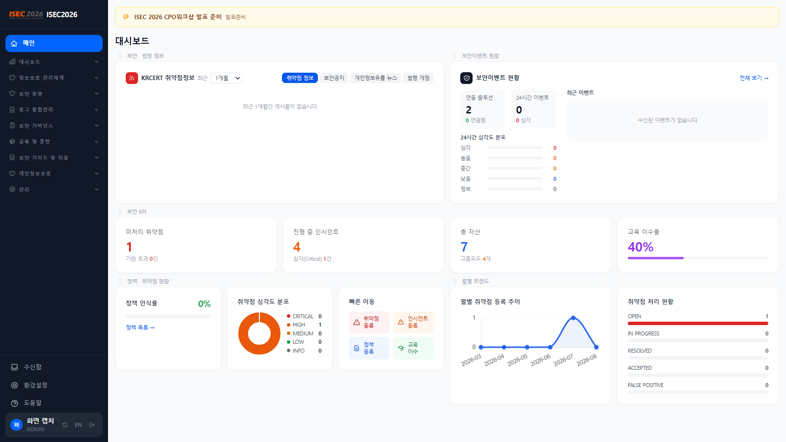

- **보안 · 법령 정보** (v1.9.0): 상단 탭에서 **취약점 정보 · 보안공지 · 법령 개정**을 전환합니다.
  - **취약점 정보**: KRCERT 취약점 공지 목록. 타이틀은 **KRCERT 취약점정보**로 표시되며, 조회 기간을 **월 단위(1주일·1개월·3개월·6개월·12개월, v1.11.1)** 로 선택합니다(기본 1개월). 취약점 공지는 드물게 갱신되어 기간을 넉넉히 두는 것이 좋습니다.
  - **보안공지**: KRCERT 보안 공지 목록. 조회 기간을 **일 단위(1·3·7·14·30일)** 로 선택합니다.
  - 취약점·보안공지는 조회 기간을 **탭별로 따로** 기억하며, 기간을 바꾸면 해당 기간으로 **서버에서 다시 조회**합니다. 게시물이 많으면 위젯 안에서 세로 스크롤됩니다.
  - **법령 개정**: 설정된 **업종의 관련 법령** 중 최근 개정·공포된 법령을 법제처 Open API로 실시간 조회합니다. 법령구분 배지·소관부처·제개정구분·시행일·공포일을 표시하며 클릭 시 법제처 상세 페이지로 이동합니다. **설정관리 > 업종 설정**의 업종 선택과 **설정관리 > API 연동**의 법제처 API 키(OC 코드)가 필요합니다. 표시 기간은 **위젯에서 바로 선택**(1주일·1개월·3개월·6개월·12개월, v1.11.0)하거나 설정관리에서 지정합니다. 관리자가 위젯에서 바꾸면 설정값도 함께 저장됩니다.
- **보안이벤트 현황**: 연동 솔루션 수, 24시간 이벤트 수, 24시간 심각도 분포(심각/높음/중간/낮음/정보)
- **보안 KPI**: 미처리 취약점 수, 진행 중 인시던트 수, 총 자산 수 요약

### 2.1 대시보드 하위 화면

좌측 **대시보드** 그룹에는 영역별 현황 화면 5개가 있습니다. 모두 실제 등록 데이터를 실시간 집계합니다.

| 화면 | 내용 |
|------|------|
| **위험현황** | 5×5 위험 히트맵, 등급별 통계, 고위험 항목 목록 |
| **취약점 현황** | 심각도 막대 차트, 조치 기한 초과 목록 |
| **인시던트 현황** | 월별 발생 추이, 최근 5건 |
| **ISMS-P 이행률** | 인증 통제항목 이행 현황 (아래 참조) |
| **증적 제출 현황** | 도메인별 증적 제출/미제출 테이블 |

#### ISMS-P 이행률

101개 인증 통제항목의 이행 상태를 **스크롤 없이 한 화면**에서 확인합니다 (v1.18.0에서 재구성).

- **상단 요약** — 전체 이행률 게이지와 상태 구성 막대, 상태별 건수(준수 · 부분 준수 · 미준수 · 증적 미제출 · 해당없음)를 한 줄에 배치합니다.
- **이행률 계산** — `준수 ÷ (전체 − 해당없음)`. 해당없음(NA)으로 판정한 항목은 분모에서 제외되므로, 적용 대상이 아닌 항목 때문에 이행률이 낮아지지 않습니다.
- **도메인별 이행률** — 21개 도메인을 인증기준 **3개 섹션**(1. 관리체계 수립 및 운영 / 2. 보호대책 요구사항 / 3. 개인정보 처리단계별 요구사항)으로 나눠 **3열**로 배치합니다. 각 줄에 도메인 코드·이름·`준수/평가대상` 건수·이행률이 표시되고, 섹션 제목 옆에는 섹션 전체 이행률이 나옵니다.
- **상태 구성 막대** — 도메인마다 **준수 · 부분 준수 · 미준수 · 증적 미제출 · 해당없음** 5개 상태를 색으로 나눈 막대와 **상태별 건수**를 함께 표시합니다. 준수율만 보는 것이 아니라 **미달 항목이 어떤 사유로 미달인지**(아직 증적을 안 냈는지, 부분만 충족했는지, 미준수 판정인지)를 한눈에 구분할 수 있습니다. 색 범례는 3열 위에 한 번 표시되며, 상단 요약 막대와 같은 색을 씁니다.
  - 0건인 상태는 막대·건수에서 **생략**되어 도메인마다 줄 수가 달라지지 않습니다. 막대에 마우스를 올리면 0건 포함 전체 내역이 툴팁으로 나옵니다.
- **색상 기준** — 이행률 숫자는 80% 이상 녹색, 60% 이상 노란색, 미만 빨간색. 평가 대상이 없으면(전부 해당없음) `—`로 표시합니다.
- **도메인 클릭** 시 **ISMS-P 증적관리**로 이동하며 해당 도메인 탭이 선택된 상태로 열립니다.
- 우측 상단 **새로고침**으로 최신 증적 등록 결과를 다시 집계합니다.

---

## 3. 자산 관리

조직의 정보자산을 등록·조회·관리합니다.

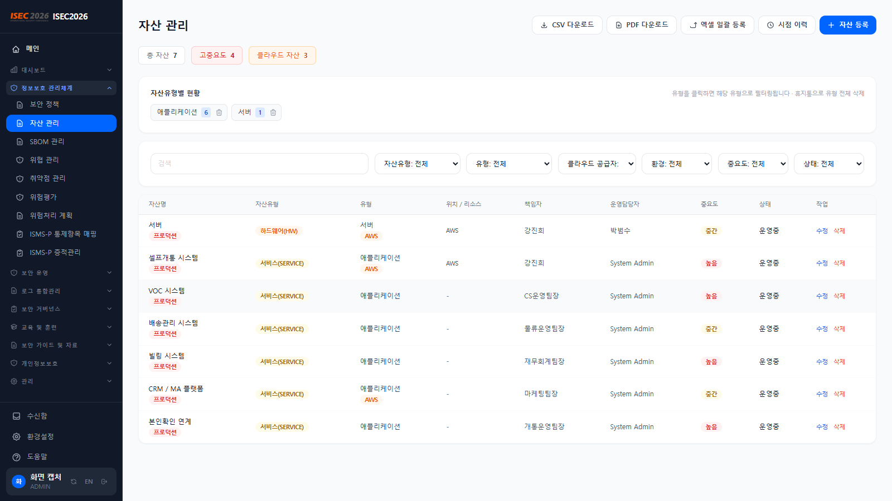

### 자산 등록

1. **자산 관리 > 자산 목록** 이동
2. 우상단 **+ 자산 등록** 버튼 클릭
3. 필수 항목 입력:
   - 자산명, 자산유형, 자산 소유자
   - 기밀성(C)·무결성(I)·가용성(A) 등급 (1~3)
4. ISMS-P 자산식별 기준 항목 입력 (확장 정보)
5. **저장** 버튼 클릭

### 자산 검색

- 자산명, 자산유형, 자산 소유자, CIA 등급 조합 검색 가능
- 검색 결과는 페이지네이션 형태로 표시

### 자산 일괄 등록

**엑셀 업로드** 버튼을 통해 CSV/Excel 형식으로 대량 등록 가능  
(템플릿 다운로드 후 작성하여 업로드)

> **팝업 UX (v1.7.0)** — 자산 **등록·수정·상세보기**는 페이지 이동 없이 팝업으로 열립니다. 목록에서 자산을 클릭하면 상세 팝업이 뜨고, 상세에서 "수정"을 누르면 수정 팝업으로 이어집니다. (정책·취약점·교육·보안사고 관리도 동일하게 팝업 방식)

### 자산유형별 현황·일괄 삭제 (v1.7.0 신규)

자산 목록 상단에 **자산유형별 자산 수** 카드가 표시됩니다. 유형을 클릭하면 해당 유형으로 필터링되고, 관리자는 유형의 휴지통 아이콘으로 해당 유형 자산을 **일괄 삭제**할 수 있습니다. 목록에는 담당자와 함께 **운영담당자·위치**가 표시됩니다.

### 자산 시점(스냅샷) 이력 (v1.7.0 신규)

상단 **시점 이력** 버튼으로 현재 자산 목록 전체를 특정 시점으로 저장·조회합니다.

1. **시점 이력** 팝업에서 제목을 입력하고 **현재 자산 목록 저장**을 클릭합니다.
2. 저장 일시·저장자와 함께 이력으로 보관되며, 이력을 클릭하면 그 시점의 자산 목록을 확인할 수 있습니다.
3. 저장 시점의 자산을 복사 보관하므로, 이후 자산이 변경·삭제되어도 시점 기록은 그대로 유지됩니다.

### SW 자산 SBOM 맵핑 (v1.2.0 신규)

자산 등록/수정 시 **자산유형**을 `소프트웨어(SW)`로 선택하면 **SBOM 맵핑** 선택란이 나타납니다.

- SBOM 관리에 등록된 SW가 있으면 드롭다운에서 선택해 맵핑합니다 (SW명·버전·라이브러리 수 표시)
- 등록된 SW가 없으면 SBOM 관리 화면으로 이동하는 안내 링크가 표시됩니다
- 맵핑된 자산의 상세 화면 식별 섹션에 SW명·버전·라이브러리 수가 표시됩니다

---

## 3.1. SBOM 관리

**자산 관리** 메뉴 아래의 **SBOM 관리**에서 소프트웨어(SW)별 버전과 포함된 라이브러리 구성요소(SBOM: Software Bill of Materials)를 **CycloneDX 1.5 표준 기준**으로 관리합니다.

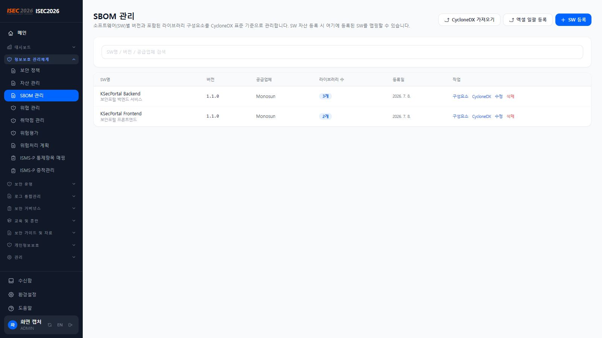
구성요소 필드는 CycloneDX component에 대응합니다 — 유형(type)·그룹(group)·라이브러리명(name)·버전(version)·PURL·라이선스(SPDX ID).

### SW 등록

1. **SBOM 관리** 이동
2. 우상단 **+ SW 등록** 버튼 클릭
3. SW명·버전(필수), 공급업체·설명·비고 입력 후 저장
   - 동일한 SW명+버전 조합은 중복 등록할 수 없습니다

### 라이브러리(구성요소) 관리

1. SW 목록에서 행 클릭 또는 **구성요소** 버튼 클릭
2. 모달 상단 입력란에 유형·그룹·라이브러리명(필수)·버전·PURL·라이선스·비고 입력 후 **추가**
3. 각 행의 수정/삭제 버튼으로 개별 관리

### CycloneDX 내보내기 / 가져오기

- **내보내기**: SW 목록 행의 **CycloneDX** 버튼 클릭 → `{SW명}-{버전}.cdx.json` 다운로드 (CycloneDX 1.5 JSON)
- **가져오기**: 우상단 **CycloneDX 가져오기** 버튼 → syft·cdxgen·trivy 등 SCA 도구가 생성한 CycloneDX JSON 업로드
  - metadata.component가 SW 정보로, components가 라이브러리로 등록됩니다
  - 동일 SW명+버전이 이미 있으면 라이브러리가 병합됩니다

### 엑셀 일괄 등록

1. **엑셀 일괄 등록** 버튼 클릭 → **엑셀 템플릿 다운로드**
2. 한 행에 라이브러리 1건씩 입력 (SW명·SW버전·라이브러리명 필수)
   - 같은 SW명+버전 행은 하나의 SW로 묶여 등록됩니다
   - 이미 등록된 SW면 라이브러리만 추가되고, 동일 라이브러리명+버전은 라이선스/비고만 갱신됩니다
3. 파일 선택 후 **등록 시작** — 행별 성공/실패 결과가 표시됩니다

### SW 삭제

SW 삭제 시 포함된 라이브러리 정보가 함께 삭제되며, 해당 SW에 맵핑된 자산은 맵핑이 자동 해제됩니다.

---

## 4. 위협 관리

위협 카탈로그를 관리합니다.

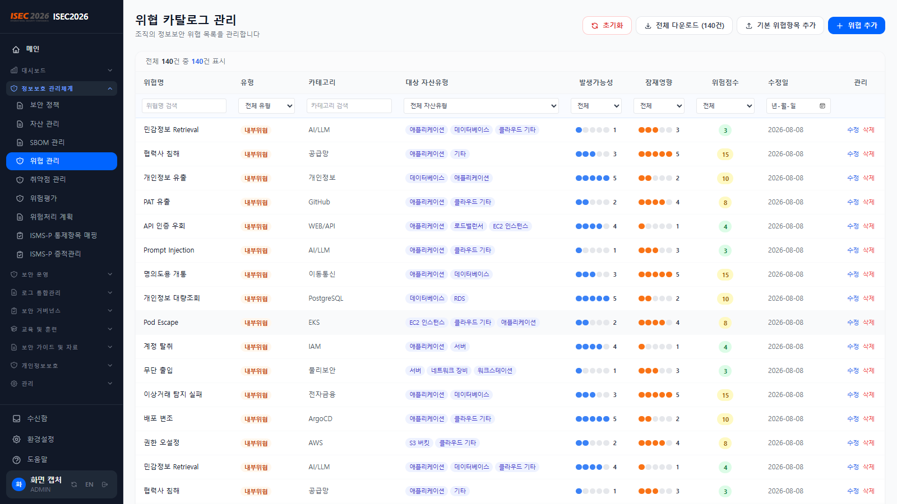

### 기본 위협 목록

MRR-0001 ~ MRR-0560까지 ISMS-P 기반 기본 위협 항목이 제공됩니다.

### 대상 자산유형 (복수 선택)

위협 추가·수정 화면에서 **대상 자산유형**을 여러 개 지정할 수 있습니다.

- 선택 항목은 **관리 > 코드관리의 `ASSET_TYPE` 그룹**에 등록된 값(사용 중인 값만)을 그대로 사용합니다. 자산유형을 늘리거나 이름을 바꾸려면 코드관리에서 수정하면 목록에 바로 반영됩니다.
- 유형 칩을 눌러 선택/해제하며, 하나도 고르지 않아도 저장됩니다(선택 항목).
- 목록의 **대상 자산유형** 열에 선택한 유형이 배지로 표시되고, 그 아래 필터에서 특정 자산유형이 지정된 위협만 골라 볼 수 있습니다.
- 코드관리에서 값이 삭제된 뒤에도 이미 저장된 위협은 저장된 코드값을 그대로 표시합니다.
- 기본 제공되는 560개 위협에는 **자산분류(SSO/MFA·DB·IDC 등) 기준으로 자산유형이 미리 할당**되어 있습니다. 조직 환경에 맞게 개별 위협에서 수정할 수 있습니다.

### 위협 목록 다운로드

화면 우측 상단의 **다운로드** 버튼으로 위협 목록을 Excel(.xlsx)로 내려받을 수 있습니다.

- 필터를 걸지 않으면 **전체 다운로드 (N건)**, 필터 적용 중에는 **검색결과 다운로드 (M건)** 로 바뀌어 화면에 보이는 목록 그대로 저장됩니다.
- 저장 항목: 위협명 · 유형 · 카테고리 · 대상 자산유형 · 자산분류 · 설명 · 발생가능성 · 잠재영향 · 위험점수 · 위험수준 · 비고 · 등록일 · 수정일

### 인라인 필터 (v1.50.0 신규)

테이블 헤더 바로 아래에 **컬럼별 필터 행**이 제공됩니다.

| 필터 | 유형 | 설명 |
|------|------|------|
| 위협명 | 텍스트 입력 | 위협명 키워드 검색 |
| 유형 | 드롭다운 | 외부공격 / 내부위협 등 선택 |
| 카테고리 | 텍스트 입력 | 카테고리 키워드 검색 |
| 대상 자산유형 | 드롭다운 | 코드관리 `ASSET_TYPE` 값 선택 — 해당 자산유형이 지정된 위협만 표시 |
| 발생가능성 | 드롭다운 | 1~5 선택 |
| 잠재영향 | 드롭다운 | 1~5 선택 |
| 위험점수 | 드롭다운 | 낮음(≤7) / 중간(8~15) / 높음(≥16) |
| 수정일 | 날짜 입력 | 특정 날짜 이후 수정된 항목 필터 |

- 화면 상단의 **"전체 N건 중 M건 표시"** 문구로 필터 결과 수를 즉시 확인할 수 있습니다.
- 필터가 적용된 경우 우상단 **필터 초기화** 버튼이 표시됩니다.
- 필터 결과가 없으면 안내 메시지와 함께 초기화 버튼이 표시됩니다.

### 사용자 정의 위협 추가

1. **위협 관리 > 위협 목록** 이동
2. **+ 위협 추가** 버튼 클릭
3. 위협명, 위협유형, 설명 입력 후 저장

---

## 5. 위험평가

자산과 위협을 연결하여 위험을 평가하고 처리방안을 관리합니다.

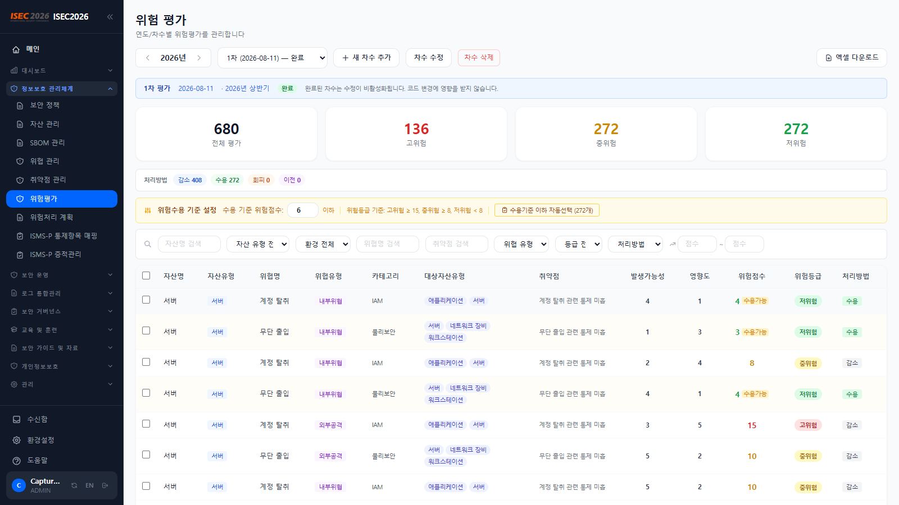

### 위험평가 차수 관리

1. **위험평가** 메뉴 이동
2. 연도 및 차수 선택 드롭다운에서 평가 차수 선택 또는 **+ 새 차수 추가** 클릭
3. 차수별로 독립적인 평가 수행

### 위험수용 기준 설정

화면 상단 **위험수용 기준 설정** 패널에서 기준 점수를 입력합니다.

- 기본값: **6점** (브라우저별 독립 저장)
- 기준 이하 항목은 **노란색 행**으로 하이라이트되고 "수용가능" 배지가 표시됩니다
- 위험점수 범위: 1~25 (가능성 × 영향도, 각 1~5)
- 참고 등급 기준:
  - 고위험: 15점 이상
  - 중위험: 8~14점
  - 저위험: 7점 이하

### 위험 항목 추가

1. **+ 평가 추가** 버튼 클릭
2. 자산 선택, 위협 선택
3. 가능성(1~5), 영향도(1~5) 입력 → 위험점수 자동 계산
4. 현재 통제 현황 입력
5. **저장**

### 검색 및 필터링

| 검색 조건 | 설명 |
|-----------|------|
| 자산명 | 자산명 키워드 검색 |
| 자산유형 | 드롭다운 선택 |
| 위협명 | 위협명 키워드 검색 |
| 위협유형 | 드롭다운 선택 |
| 처리방법 | 수용/완화/회피/이전 선택 |
| 위험등급 | 고위험/중위험/저위험 선택 |
| 위험점수 범위 | 최소~최대 점수 입력 |

**초기화** 버튼으로 모든 필터를 한번에 초기화합니다.

### 체크박스 및 일괄 처리

**개별 선택**
- 각 행 맨 앞 체크박스를 클릭하여 선택

**전체 선택**
- 테이블 헤더의 체크박스 클릭
  - 전체 선택됨: ✓ 체크됨
  - 일부 선택됨: — (indeterminate) 상태
  - 없음: 빈 상태

**수용기준 이하 자동선택**
- 현재 필터링된 항목 중 수용 기준 이하 점수 항목을 모두 자동 선택

**수용완료 일괄처리**
- 선택된 항목의 처리방법을 "수용"으로 일괄 변경
- 실행 전 확인 모달이 표시됩니다

### 위험 처리방법

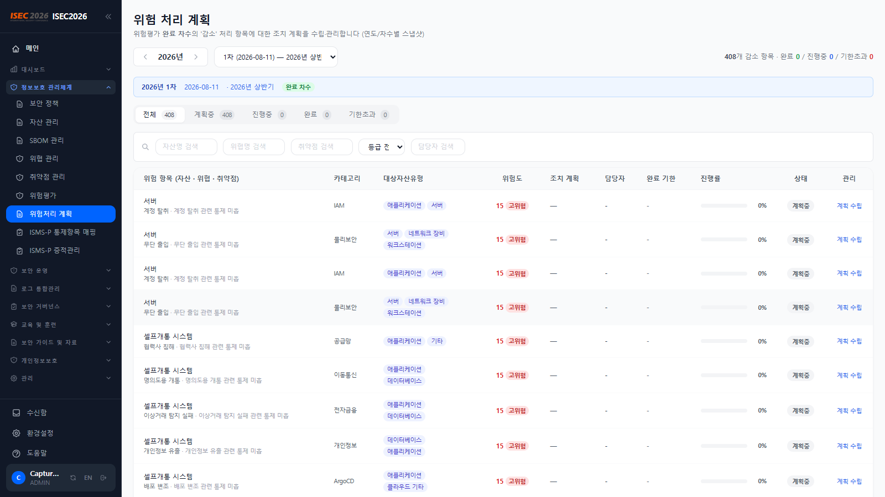

| 처리방법 | 설명 |
|----------|------|
| 수용 | 위험을 인지하고 그대로 수용 |
| 감소 | 통제수단을 적용하여 위험 감소 (v1.7.0에서 '경감'→'감소'로 용어 변경) |
| 회피 | 위험 유발 활동/자산 제거 |
| 이전 | 위험을 제3자(보험 등)에 이전 |

항목을 선택하면 **수용·감소·회피·이전** 처리방법을 일괄 적용할 수 있으며, 검색 필터에서 처리방법·취약점으로도 조회할 수 있습니다. 상단 요약 카드·처리방법별 현황은 검색 필터와 무관하게 **차수 전체 기준**으로 표시됩니다.

### 위험 처리 계획 (v1.7.0 개편)

**위험 처리 계획** 메뉴는 위험평가에서 **완료 처리한 차수**의 처리방법 **'감소'** 항목을 가져와 조치 계획을 수립하는 화면입니다.

1. 연도를 이동해 **완료된 차수**를 선택합니다.
2. 해당 차수의 '감소' 항목이 처리 대상으로 표시됩니다(위험점수 높은 순).
3. 항목의 **계획 수립**을 눌러 조치 계획·담당자·완료 기한·진행률·상태를 입력합니다.
4. 계획은 각 평가 항목(연도/차수)에 귀속되어 **차수별 스냅샷**으로 보관됩니다.

자산·위협·취약점·등급·담당자 검색, 상태 탭(계획중/진행중/완료/기한초과), 페이지네이션을 제공합니다.

### 위험평가 결과 다운로드

**엑셀 다운로드** 버튼으로 자산별 개별 시트 형태의 엑셀 파일을 내려받습니다.

---

## 6. 취약점 관리

시스템 취약점을 등록하고 조치 현황을 추적합니다.

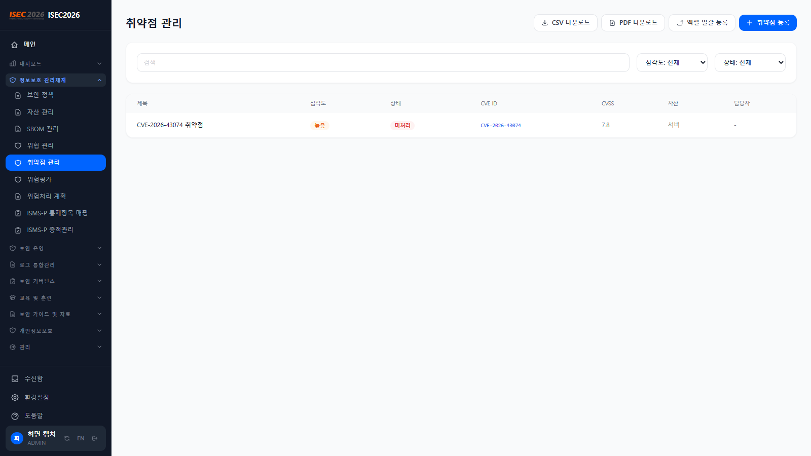

### 취약점 등록

1. **취약점 관리** 메뉴 이동
2. **+ 취약점 등록** 버튼 클릭
3. 취약점명, 심각도(Critical/High/Medium/Low), 영향 시스템, 조치기한 입력
4. **저장**

### 상태 관리

- **미처리** → **처리중** → **처리완료** 순으로 상태 변경
- 조치기한 초과 시 자동으로 "기한초과" 표시

### CVE 설명 보기

목록의 **CVE ID**(또는 상세 화면의 CVE 뱃지)를 클릭하면 팝업으로 취약점 설명이 열립니다.

- **NVD(nvd.nist.gov)에서 조회한 설명**과 심각도·CVSS 점수를 함께 표시합니다.
- 하단의 **NVD 원문 보기**로 원문 페이지를 새 창에서 열 수 있습니다.
- 목록에서 CVE를 클릭해도 취약점 상세는 열리지 않습니다(행의 다른 영역을 클릭하세요).
- NVD 조회에 실패하거나 등록되지 않은 CVE는 안내 문구와 원문 링크만 표시됩니다.

---

## 7. 인시던트 관리

보안 인시던트를 등록하고 처리 과정을 기록합니다.

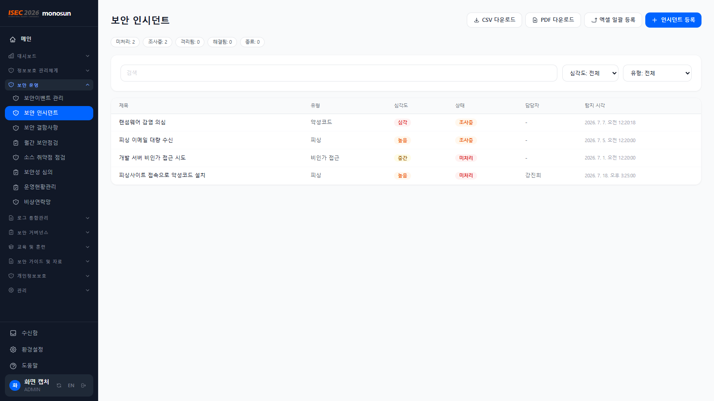

### 인시던트 등록

1. **인시던트 관리** 메뉴 이동
2. **+ 인시던트 등록** 버튼 클릭
3. 제목, 발생일시, 유형, 심각도, 설명 입력
4. **저장**

### 처리 이력 기록

인시던트 상세 화면에서 처리 단계별 이력을 추가할 수 있습니다.

---

## 8. ISMS-P 이행 관리

ISMS-P 인증 심사 대비 통제항목별 이행 현황을 관리합니다.

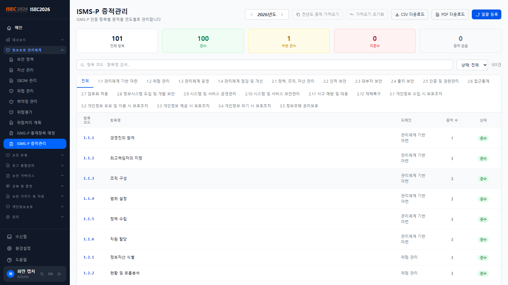

### 통제항목 조회

- 2.xx.x 형태의 ISMS-P 통제항목 코드 기준으로 구조화된 목록 제공
- 영역별 탭 필터 제공: 전체 / 1.1~1.4 관리체계 기반 / 2.2~2.12 보호대책 / 3.1~3.5 개인정보 보호

### 증적 자료 관리

1. 통제항목을 클릭하면 **팝업**이 열립니다 (v1.13.0 — 종전에는 별도 화면으로 이동)
2. **증적 추가** 버튼으로 문서/파일 첨부
3. 이행 상태(양호/부분이행/미이행/해당없음) 변경
4. 기존 증적 참조 검색으로 다른 통제항목의 증적을 재활용 가능
5. 팝업을 닫지 않고 여러 항목을 연달아 확인할 수 있으며, 증적을 등록·삭제하면 뒤쪽 목록의 건수·상태가 즉시 갱신됩니다

> 팝업 안에서 연도를 바꾸면 목록의 조회 연도도 함께 변경됩니다.

### 전년도 증적 가져오기

연도 이동 버튼 옆의 **전년도 증적 가져오기** 버튼으로, 이전 연도에 등록한 증적을 조회 중인 연도로 한 번에 복사합니다.

1. 목록 상단에서 복사받을 연도(예: 2026)를 선택합니다
2. **전년도 증적 가져오기** 클릭 → 확인 팝업에서 원본 연도(증적이 있는 가장 최근 연도)를 확인하고 **가져오기**
3. 복사 결과(증적 건수 · 현재상태/의견 건수 · 건너뛴 항목 수)가 목록 위에 표시됩니다

- 복사 대상: **증적제목 · 증적내용 · 준수상태 · 첨부파일**(파일은 실물이 복제되므로 한쪽 연도의 증적을 지워도 다른 연도는 유지됩니다) + **연도별 현재 상태·의견**
- 선택한 연도에 **이미 증적이 등록된 항목은 건너뜁니다** — 여러 번 눌러도 중복 복사되지 않습니다
- 가져올 이전 연도 증적이 없으면 버튼이 비활성화됩니다
- 관리자/담당자 권한이 필요합니다

> 가져온 뒤에는 항목 팝업에서 증적 내용·준수상태를 해당 연도에 맞게 수정하면 됩니다.

### 가져오기 초기화 (되돌리기)

**전년도 증적 가져오기** 옆의 **가져오기 초기화** 버튼으로, 가져오기 전 상태로 되돌립니다.

- 가져오기로 생성된 증적·현재상태·의견만 삭제합니다. **직접 등록·작성한 증적과 의견은 삭제되지 않습니다.**
- 원본 연도(가져온 연도)의 증적과 첨부파일은 그대로 유지됩니다.
- **가져온 뒤 수정한 내용도 함께 삭제**되므로 확인 팝업의 삭제 건수를 확인한 후 실행하세요.
- 가져온 증적을 다른 항목에서 참조(🔗)하고 있으면 그 참조 증적도 함께 삭제되며, 결과 메시지에 건수가 표시됩니다.
- 되돌릴 가져오기 내역이 없으면 버튼이 비활성화됩니다. 관리자/담당자 권한이 필요합니다.

### 의견 · 현재 상태 · 이행 가이드 (v1.13.0)

통제항목 팝업에서 증적 외에 **설명 필드 3종**을 작성합니다. 저장 단위가 다르니 용도에 맞게 사용하세요.

| 필드 | 저장 단위 | 용도 |
|------|----------|------|
| **이행 가이드** | 항목 (연도 무관) | 이 인증기준을 충족하려면 무엇을 준비해야 하는지에 대한 안내. 한 번 작성하면 **모든 연도에서 동일하게** 표시됩니다 |
| **현재 상태 설명** | 항목 + 연도 | 해당 연도 기준으로 이 항목이 실제 어떻게 운영되고 있는지 |
| **의견** | 항목 + 연도 | 담당자 의견, 보완 필요사항, 심사 대응 메모 |

- **이행 가이드**는 팝업 상단의 접이식 영역(💡 이행 가이드)에서 펼쳐 작성합니다.
- **현재 상태·의견**은 조회 중인 연도에 저장되므로, 연도를 바꾸면 그 연도에 작성한 내용이 표시됩니다.
- 작성자와 최종 수정일이 함께 기록됩니다.
- 작성·수정은 관리자/담당자 권한이 필요하며, 조회는 열람 권한이 있으면 가능합니다.

### ISMS-P 통제항목 매핑

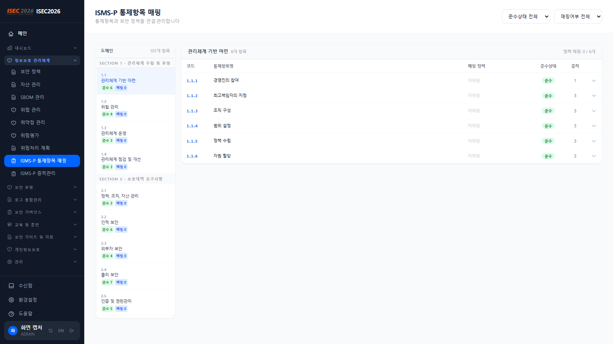

위험평가 결과와 ISMS-P 통제항목을 연결하여 이행 현황을 추적합니다.

---

## 8.5 소스 취약점 점검 (SAST)

GitHub 저장소의 소스코드를 **OWASP 기준으로 정적분석(SAST)** 하고, GitHub 보안 알림(의존성·코드·시크릿)과 함께 취약점을 점검합니다. **보안 운영 > 소스 취약점 점검** 메뉴에서 사용합니다. (MANAGER 이상)

### 사전 준비 — GitHub 연동

1. GitHub에서 **Personal Access Token**을 발급합니다 (Settings → Developer settings). 저장소 코드 읽기 권한이 필요하며, Dependabot·Code scanning·Secret scanning 알림을 함께 조회하려면 관련 읽기 권한을 부여합니다.
2. **관리 > 설정관리 > API 연동** 탭에서 토큰과 (선택) API Base URL을 등록하고 **연결 테스트**로 확인합니다. GitHub Enterprise는 API Base URL을 지정합니다. (토큰 등록·조회는 ADMIN 전용, 응답은 마스킹 처리)

### 점검 실행

1. **소스 취약점 점검** 메뉴로 이동합니다.
2. **저장소 목록 불러오기**로 접근 가능한 저장소를 조회하거나 `owner/repo` 형식으로 직접 입력합니다.
3. **점검 실행**을 누르면 다음 4개 카테고리를 함께 점검합니다:
   - **의존성** — GitHub Dependabot 알림
   - **코드** — GitHub Code scanning(CodeQL 등) 알림
   - **시크릿** — GitHub Secret scanning 알림
   - **SAST** — 저장소 소스를 직접 내려받아 OWASP Top 10 기준으로 정적분석 (SQL/명령/코드 인젝션, 취약 암호·해시, 하드코딩 비밀·개인키, 안전하지 않은 역직렬화, TLS 검증 비활성화, CORS/CSRF 설정 오류 등)
4. 결과는 심각도(심각/높음/중간/낮음)와 카테고리별로 집계되어 점검 이력에 저장됩니다.

> 의존성·코드·시크릿 카테고리는 해당 GitHub 기능이 저장소에 활성화되어 있어야 결과가 조회됩니다. **SAST는 별도 활성화 없이** 소스를 직접 분석하며, 각 발견 항목은 OWASP/CWE 분류와 파일·라인 위치, GitHub 링크를 제공합니다.

> **오탐 억제**: 검토 결과 문제가 없다고 판단한 줄은 소스에 `// sast:ignore 사유`(또는 `# sast:ignore …`) 주석을 남기면 다음 점검부터 해당 줄을 건너뜁니다. 사유를 반드시 함께 적어 근거를 남기세요.

### 점검 이력·상세

- 이력에서 저장소·점검 일시·상태·심각도·카테고리별 발견 수를 확인합니다.
- 항목을 클릭하면 카테고리 필터로 발견 내역(심각도·구분·내용·대상/위치·CWE·CVE·링크)을 조회합니다.
- MANAGER 이상은 점검 이력을 삭제할 수 있습니다.

### CWE 설명 보기

발견 내역의 **CWE** 열(CVE 앞)에 표시된 `CWE-XXX`를 클릭하면 팝업으로 상세 설명이 열립니다.

- **무엇인가 / 위험 / 조치 방법**(구체적 수정 지침)을 한 화면에서 확인합니다.
- 하단의 **MITRE CWE 원문 보기**로 cwe.mitre.org 정의를 새 창에서 열 수 있습니다.
- SAST 발견 항목에 표시되며, GitHub 알림(의존성 등)처럼 CWE가 없는 항목은 `-`로 표시됩니다.
- 내부 설명이 등록되지 않은 CWE는 안내 문구와 MITRE 링크만 제공합니다.

### PDF 보고서 다운로드

점검 상세 우측의 **PDF 보고서** 버튼으로 해당 점검 결과를 보고서로 내려받습니다. (MANAGER 이상)

- 파일명은 `소스취약점점검-저장소명-YYYYMMDD.pdf` 형식입니다.
- 구성: 저장소·점검일시 → 심각도 요약(전체/심각/높음/중간/낮음) → **심각도·카테고리 분포 막대** → **발견 내역 표**(심각도·구분·제목·식별자·위치·CVE)
- 카테고리 조회가 일부 실패한 점검(PARTIAL)은 사유가 보고서 상단에 함께 표시됩니다.
- 가로 방향 A4로 생성되어 긴 파일 경로·룰 이름이 잘리지 않습니다.
- 화면 필터와 무관하게 **해당 점검의 전체 발견 내역**이 실립니다.

---

## 8.6 보안성 심의

신규 시스템을 구축하거나 기존 시스템을 변경할 때, **설계 단계에서 보안 요구사항 충족 여부를 검토**하는 절차입니다. **보안 운영 > 보안성 심의** 메뉴에서 사용합니다.

### 진행 흐름

```
요청 접수 → 검토중 → (보완 요청) → 심의 완료(승인 / 조건부 승인 / 반려)
```

### 1) 심의 요청 (현업 담당자)

1. **심의 요청** 버튼 클릭
2. 심의 제목, 대상 시스템·서비스, **심의 구분**(신규 구축 / 변경·고도화 / 외부 연계 / 폐기·종료) 입력
3. 요청 부서, 오픈(적용) 예정일, 구축·변경 개요 작성
4. **개인정보를 처리함 / 인터넷에 공개됨** 해당 항목 체크 — 검토 시 중점 확인 대상이 됩니다
5. 설계서를 첨부하고 **요청 등록**

> 요청을 등록하면 **기본 검토 체크리스트 20개 항목**(인증·권한 / 접근통제 / 암호화 / 개인정보 / 로그·감사 / 개발보안 / 운영·보안설정)이 자동으로 만들어집니다.

### 2) 설계 검토 (보안 담당, MANAGER 이상)

- 목록에서 심의 건을 클릭하면 상세와 체크리스트가 열립니다.
- 항목별로 **적합 / 부적합 / 해당없음**을 누르고, 아래 입력란에 **검토 의견·보완 요구사항**을 적습니다(입력 후 포커스를 벗어나면 저장).
- 심의 특성에 맞는 항목이 더 필요하면 **+ 항목 추가**로 영역·항목·검토 기준을 직접 추가할 수 있습니다.
- 첫 검토 결과를 입력하면 상태가 **검토중**으로 자동 전환됩니다.
- 현업 조치가 필요하면 **보완 요청으로 변경**을 눌러 상태를 바꿉니다.

### 3) 심의 결과 등록

- **승인 / 조건부 승인 / 반려** 중 하나를 고르고 심의 의견(승인 조건·보완 요구사항)을 적은 뒤 **심의 결과 등록**을 누릅니다.
- **미검토 항목이 남아 있으면 등록되지 않습니다** — 모든 항목을 적합·부적합·해당없음 중 하나로 판정해야 합니다.
- 등록 후에는 심의자와 심의일이 함께 기록되며, 필요 시 **재검토로 되돌리기**로 다시 검토 상태로 전환할 수 있습니다.

### 목록·현황

- 상단 카드에서 **요청 접수 / 검토중 / 보완 요청 / 심의 완료 / 승인 / 조건부·반려** 건수를 보고, 카드를 누르면 해당 상태로 필터링됩니다.
- 목록에는 검토 진행률(검토 완료 항목 수)과 **부적합 건수**가 함께 표시됩니다.
- 상태·구분 필터와 제목·시스템명·요청부서 검색을 제공합니다.

> 심의 요청은 로그인한 사용자 누구나 할 수 있고, **검토·결과 등록·삭제는 MANAGER 이상**입니다. 요청 등록·결과 확정·삭제는 감사로그에 기록됩니다.

---

## 8.7 운영현황관리

정보보호·개인정보보호 관리체계를 **연간 어떤 활동을 언제 수행하기로 했고, 실제로 수행했는지**를 한 표에서 관리합니다.
**보안 운영 > 운영현황관리** 메뉴이며, ISMS-P 심사 시 제출하는 *정보보호 관리체계 운영현황표* 서식을 그대로 옮긴 형태입니다.

### 화면 구성

상단 탭에서 두 가지 관리체계를 전환합니다.

| 탭 | 내용 | 표 구성 |
|----|------|---------|
| **정보보호 관리체계** | 정책관리·자산관리·접근통제·암호화 관리·물리적 보안·인적보안·사고대응·기타 8개 구분의 연간 운영 점검 | 구분 · 점검 기준 · 주기·시점 · 보안적용 실적 · 책임자 · 실무자 · 1~12월 |
| **개인정보보호 관리체계** | 처리방침 업데이트·내부관리계획·교육·수탁자 관리 등 법정 주기 점검 | 점검항목 · 점검주기 · 상세 내용 · 1~12월 |

연도는 우측 상단 **← 2026년 →** 로 이동하며, 연도마다 항목 구성과 이행 실적이 따로 보관됩니다.

### 1) 연도 구성하기

처음 여는 연도는 비어 있습니다. 아래 두 가지 방법으로 채웁니다. (MANAGER 이상)

- **기본 항목 불러오기** — **관리 > 코드 관리 > 운영현황 기본항목**에 등록된 **사용 중인** 항목을 월별 계획과 함께 불러옵니다(최초 기본값: 정보보호 45개 / 개인정보보호 10개).
- **전년도 구성 복사** — 직전 연도의 항목과 월별 계획을 그대로 가져오고 **이행 실적은 초기화**합니다. 매년 초에 쓰는 방식입니다.

두 기능 모두 **해당 연도·구분에 이미 항목이 있으면 실행되지 않습니다**(중복 방지). 다시 구성하려면 **이 구분 전체 삭제**로 비운 뒤 실행하세요.

**항목 추가**로 조직 상황에 맞는 점검 항목을 직접 등록할 수도 있고, 각 행의 **수정**으로 문구·주기·담당자·월별 계획을 바꿀 수 있습니다.

항목을 추가할 때 **점검 기준(점검항목)은 코드 관리에 등록된 기본항목에서 선택**합니다(구분별로 묶여 표시).
선택하면 **주기·산출물·책임자·실무자·월별 계획이 함께 채워지고**, 이후 자유롭게 수정할 수 있습니다.
목록에 없는 항목은 **＋ 목록에 없음 — 직접 입력**을 고르면 직접 입력할 수 있습니다.
기본항목 목록은 **관리 > 코드 관리 > 운영현황 기본항목**에서 관리합니다.

### 2) 월별 이행 관리

표의 1~12월 칸은 클릭 한 번으로 이행 여부가 바뀝니다.

| 표시 | 의미 |
|------|------|
| **○** (회색) | 계획된 달 — 아직 미이행 |
| **● (녹색)** | 계획된 달 — 이행 완료 |
| **▲ (주황)** | 계획에 없었지만 수행함 (계획 외 수행) |
| (빈칸) | 계획 없음 |

- **계획(○)** 은 항목 수정 화면의 *월별 계획*에서 지정합니다. **매월 / 전체 해제** 버튼으로 한 번에 설정할 수 있습니다.
- *상시*·*수시* 항목처럼 특정 월 계획이 없는 경우에는 계획을 모두 해제해 두고, 실제 수행한 달에만 표에서 이행 표시를 하면 됩니다(▲로 기록됨).
- 행 끝의 **이행** 열은 `이행/계획` 건수이며, 계획을 모두 채우면 녹색으로 바뀝니다.

### 3) 요약

표 위 요약 카드에서 선택한 구분의 현황을 확인합니다.

- **이행률** = 이행 완료 칸 ÷ 계획된 칸 (90% 이상 녹색, 70% 이상 노랑, 미만 빨강)
- **점검 항목** 수, **미이행** 칸 수, **계획 외 수행** 칸 수
- **월별 계획 대비 이행** 막대 — 막대 높이는 그 달의 계획 건수, 채워진 부분은 이행 건수입니다.

> 조회는 로그인한 사용자 누구나 가능하고, **항목 등록·수정·삭제와 이행 표시는 MANAGER 이상**입니다. 항목 등록·수정·삭제와 연도 구성(불러오기·복사·전체 삭제)은 감사로그에 기록됩니다.

---

## 9. 내부 감사

내부 정보보호 감사 계획 수립 및 수행 이력을 관리합니다.

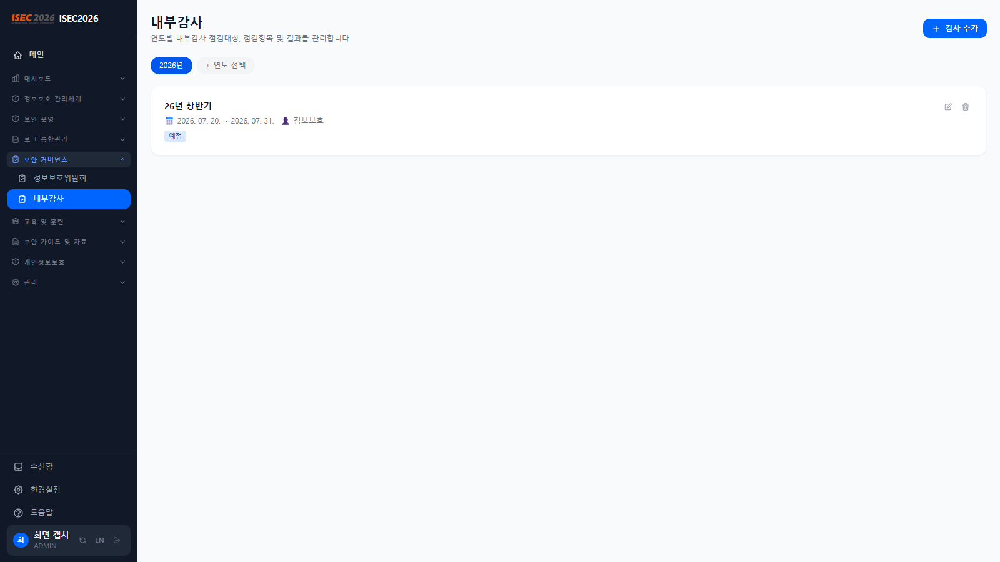

### 감사 등록

1. **내부 감사** 메뉴 이동
2. **+ 감사 등록** 버튼 클릭
3. 감사명, 감사기간, 감사 대상 조직, 감사 유형 입력
4. 감사 항목 추가 및 체크리스트 작성

---

## 10. 보안 문서

보안 정책·지침·절차 문서를 관리합니다.

> **메뉴 위치 안내**: 좌측 메뉴의 **문서관리** 그룹은 **보안 가이드 및 자료**로 이름이 바뀌었습니다. 가이드·체크리스트·템플릿 등 모든 자료는 그 아래 **보안문서** 화면 한 곳에서 분류(카테고리)로 구분해 관리합니다.

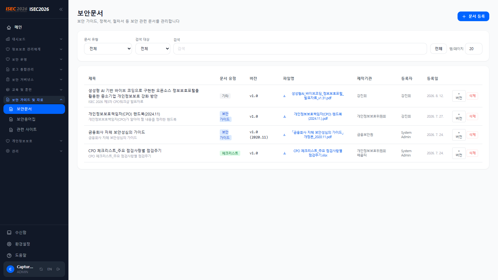

### 문서 등록

1. **보안 문서** 메뉴 이동
2. **+ 문서 등록** 버튼 클릭
3. 문서명, 카테고리, 상태(초안/검토/시행/폐기), 버전, 시행일 입력
4. **내용**을 마크다운 편집기로 작성
5. **저장**

### 마크다운 편집기 (v1.12.1)

정책 본문은 **마크다운**으로 작성하며, 저장된 글은 상세 화면에서 서식이 적용된 형태로 표시됩니다.

- 편집기 상단 **툴바**로 제목·굵게·기울임·목록·번호목록·인용·링크·코드·표·구분선을 넣습니다. 텍스트를 선택한 뒤 누르면 선택 영역에 적용되고, 선택 없이 누르면 예시 문구가 들어갑니다.
- 오른쪽 **편집 / 미리보기** 탭으로 실제 표시 모습을 확인하며 작성합니다.
- **줄바꿈은 입력한 그대로 반영**됩니다(엔터 = 줄바꿈).
- 편집 중 **Tab** 키는 다음 칸으로 넘어가지 않고 들여쓰기로 동작합니다.

자주 쓰는 문법:

| 입력 | 결과 |
|------|------|
| `## 제목` | 중간 제목 (`#`이 많을수록 하위 제목) |
| `**굵게**` / `*기울임*` | **굵게** / *기울임* |
| `- 항목` | 글머리 목록 |
| `1. 항목` | 번호 목록 |
| `> 문구` | 강조 인용 박스 |
| `| 항목 | 내용 |` | 표 (구분선 `|---|---|` 필요) |

> 미리보기 상태에서도 저장할 수 있지만, 내용이 비어 있으면 저장되지 않고 안내 문구가 표시됩니다.

### 여러 정책 한 번에 삭제

목록 왼쪽의 **체크박스**로 여러 정책을 선택해 한 번에 삭제할 수 있습니다. (**관리자(ADMIN) 전용** — 관리자가 아니면 체크박스가 보이지 않습니다.)

1. 삭제할 정책 행의 체크박스를 선택합니다. 머리글의 체크박스로 **현재 페이지 전체 선택**도 가능합니다.
2. 목록 위에 **N건 선택됨**과 **선택 삭제** 버튼이 나타납니다.
3. **선택 삭제** → 확인 창에서 삭제할 정책 제목을 확인하고 **삭제**를 누릅니다.

- 페이지를 넘겨도 선택은 유지되므로 여러 페이지에서 골라 한 번에 삭제할 수 있습니다(확인 창에 다른 페이지 선택분도 함께 표시).
- 정책에 연결된 **열람 확인 기록도 함께 삭제**되며, 삭제는 되돌릴 수 없습니다.
- 체크박스를 클릭해도 상세 팝업은 열리지 않습니다. 상세를 보려면 행의 다른 영역을 클릭하세요.

### 가이드 · 체크리스트 등 자료 관리 (보안문서)

**보안 가이드 및 자료 > 보안문서** 화면에서 가이드·체크리스트(엑셀 등)·템플릿 자료를 **분류별로 등록하고 버전으로 관리**합니다.

#### 자료 등록

1. **문서 등록** 버튼 클릭 (MANAGER 이상)
2. 제목, **분류**(가이드 / 체크리스트 / 템플릿 / 절차서 등), 버전(기본 `1.0`), 설명, 제작기관 입력
3. **엑셀·PDF 등 파일 첨부** 후 저장

#### 버전 관리

- 목록의 **+ 버전** 버튼으로 같은 자료의 새 버전을 올립니다. 최신 버전이 목록에 표시되고 이전 버전은 이력으로 보관됩니다.
- 버전 옆의 **N개 버전** 배지를 누르면 **버전 이력**이 열리고, 각 버전을 내려받거나 개별 삭제할 수 있습니다.
- **삭제**는 해당 자료의 전체 버전을 지웁니다(되돌릴 수 없음). 등록·버전 추가·삭제는 **감사로그에 기록**됩니다(`SEC_DOC_CREATED` / `SEC_DOC_VERSION_ADDED` / `SEC_DOC_DELETED`).

#### 조회

- 상단 **분류** 필터로 체크리스트만 골라 볼 수 있습니다.
- 제목·내용·파일명·버전·제작기관을 대상으로 검색할 수 있습니다(검색 대상 선택).

#### 파일 미리보기

목록의 **파일명을 클릭하면 내려받지 않고 팝업으로 내용을 먼저 볼 수 있습니다.** (버전 이력에서는 **미리보기** 버튼)

| 형식 | 미리보기 |
|------|----------|
| PDF | 문서 뷰어로 표시(페이지 이동·확대 가능) |
| 이미지 (jpg·png·gif·webp) | 원본 비율로 표시 |
| 엑셀 (xlsx·xls) · CSV | **표로 변환해 표시**, 시트가 여러 개면 상단 탭으로 전환 (첫 300행) |
| 텍스트 (txt) | 본문 그대로 표시 |
| 워드·PPT·ZIP 등 | 미리보기를 지원하지 않아 안내 문구와 다운로드 버튼만 표시 |

- 팝업 우상단 **다운로드** 버튼으로 원본 파일을 내려받을 수 있습니다.
- 엑셀 미리보기는 값만 보여주므로 서식·수식·차트는 표시되지 않습니다. 정확한 확인은 다운로드해 주세요.
- 등록·버전 추가·삭제는 MANAGER 이상, 조회·다운로드는 열람 권한이 있으면 가능합니다.

---

## 10.1 보안용어집

보안 실무·교육에서 자주 쓰는 용어를 한글·영문·약어·분류·정의로 찾아보는 화면입니다.
**보안 가이드 및 자료 > 보안용어집** 메뉴이며, 로그인한 사용자 누구나 조회할 수 있습니다.

기본 제공 용어는 **178개**이며 **20개 분류**(접근통제 · 보안원칙 · 위험관리 · 보안관리 · 네트워크 보안 · 암호기술 · 악성코드 · 사회공학 · 물리보안 · 애플리케이션 보안 · 공급망 보안 · 취약점 표준 · 사고대응 · 복구·연속성 · 데이터 보호 · 로그·감사 · 클라우드 보안 · 개발보안 · 위협 인텔리전스 · 보안위협)로 나뉩니다.

### 찾는 방법

| 방법 | 설명 |
|------|------|
| **통합 검색** | 한글 용어·영문 표기·약어·분류·의미·관련 키워드를 한 번에 검색합니다 (예: `MFA`, `암호화`, `phishing`) |
| **분류 필터** | 분류 버튼을 눌러 해당 분류만 봅니다. 버튼에 분류별 용어 수가 표시됩니다 |
| **약어 색인** | AAA · IAM · SIEM · EDR 등 약어 버튼을 누르면 그 약어로 검색합니다 |
| **키워드 태그** | 용어 아래 관련 키워드를 누르면 그 값으로 다시 검색합니다 |

목록은 **분류별로 묶여** 표시되며, 각 용어는 `한글 용어 · 약어 배지 · 영문 표기 · 의미 · 관련 키워드` 순으로 나옵니다.

> 용어 내용은 **관리 > 코드 관리 > 용어집** 탭에서 관리합니다(ADMIN). 용어집 화면 우측 상단의 **용어 관리** 버튼으로 바로 이동할 수 있습니다.

---

## 10.2 관련 사이트

보안·개인정보 업무에서 자주 찾는 외부 사이트를 등록해 두고, **각 사이트의 최신 게시물을 카드로 모아 보는** 화면입니다.
**보안 가이드 및 자료 > 관련 사이트** 메뉴이며, 로그인한 사용자 누구나 조회할 수 있습니다.

기본으로 **15개 사이트**가 등록되어 있습니다 — 침해사고·취약점(보호나라, KNVD 보안공지·취약점 정보, 미국 CISA, NVD), 유관기관(KISA, 개인정보보호위원회, 개인정보 포털, 국가사이버안보센터, 금융보안원), 법령·인증(국가법령정보센터, 개인정보보호위원회 고시·해설서), 보안 동향(보안뉴스, 데일리시큐, OWASP).

### 화면 구성

각 사이트는 카드 하나로 **한 열에 차례대로** 표시됩니다.

| 영역 | 내용 |
|------|------|
| 카드 머리 | 사이트 이름(클릭 시 새 탭으로 이동) · 분류 배지 · 도메인 · 설명 · 바로가기 |
| 본문 | 가져온 **최신 게시물 최대 5건**(제목 · 게시일 · 요약 한 줄). 게시물 목록을 제공하지 않는 사이트는 **사이트 소개 내용**을 대신 표시합니다 |
| 카드 발 | 수집 상태와 마지막 수집 시각 |

> 가져온 내용이 없는 사이트(외부 접속 차단·수집 실패 등)는 본문 없이 **한 줄로 접혀** 표시되고, 그 자리에 수집 상태만 나옵니다.

- 상단 검색창은 사이트 이름·주소·설명뿐 아니라 **가져온 게시물 제목·요약까지** 함께 찾습니다.
- 분류 버튼으로 원하는 분류만 볼 수 있습니다(버튼에 사이트 수 표시).

### 내용은 어떻게 가져오나요

- 사이트가 제공하는 **RSS/Atom 피드**에서 최신 게시물을 최대 5건 가져와 보관합니다.
- 피드 주소를 입력하지 않으면 홈페이지에서 **피드 링크를 자동으로 찾습니다**.
- 피드가 없는 사이트는 홈페이지의 **소개 문구(og 메타)** 만 가져옵니다.
- 수집은 **매일 새벽(기본 07:10)에 자동**으로 이루어지며, 화면에서 **전체 새로고침**(우상단) 또는 카드별 **새로고침**으로 즉시 다시 가져올 수 있습니다.
- 폐쇄망 등으로 외부 접속이 막혀 있으면 내용 없이 **링크만** 표시되고, 카드 발에 수집 실패 사유가 표시됩니다.

### 사이트 등록·수정 (MANAGER 이상)

우측 상단 **사이트 등록** 버튼 또는 카드의 **수정**·**삭제** 버튼을 사용합니다.

| 항목 | 설명 |
|------|------|
| 사이트 이름 | 카드에 표시되는 이름 (필수) |
| 홈페이지 주소 | `http://` 를 생략하면 `https://` 로 저장됩니다 (필수, 중복 등록 불가) |
| 게시물 목록(RSS/Atom) 주소 | 비워두면 홈페이지에서 자동으로 찾습니다 |
| 분류 | 카드의 분류 배지·필터에 쓰입니다 (기존 분류 중 선택하거나 직접 입력) |
| 정렬 순서 | 숫자가 작을수록 위에 표시됩니다 |
| 설명 | 어떤 업무에 참고하는 사이트인지 적어둡니다 |
| 사용 | 해제하면 화면에서 숨겨집니다. **미사용 포함** 체크박스로 다시 꺼내 볼 수 있습니다 |

> 등록·수정 직후 해당 사이트의 내용을 한 번 가져오므로 저장에 몇 초가 걸릴 수 있습니다.
> 기본 사이트는 목록이 **비어 있을 때만** 다시 채워지므로, 쓰지 않는 사이트는 삭제보다 **사용 해제**를 권장합니다.

---

## 11. 정보보호위원회

정보보호위원회 회의록을 등록하고 첨부파일을 관리합니다.

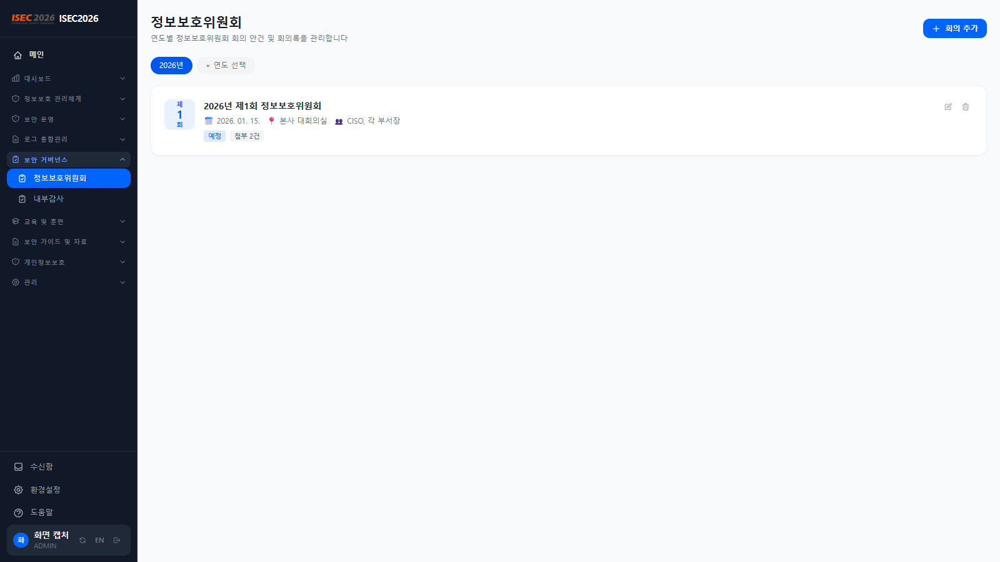

---

## 12. 월간 보안점검

월별 정보보호 점검 항목(정보보호의 날)을 체크하고 결과를 기록합니다.

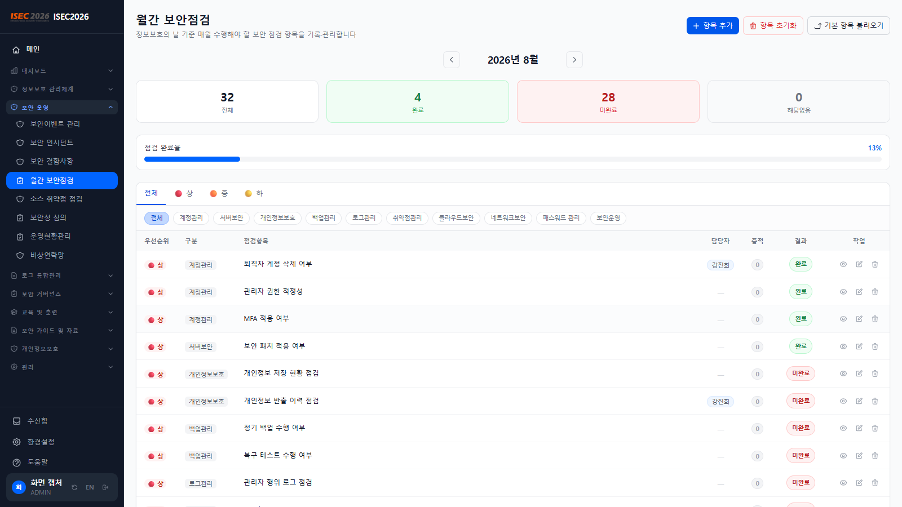

### 이전 월 점검 항목 복사 (v1.8.0)

매월 점검 항목을 처음부터 다시 구성할 필요 없이, **직전에 점검한 달의 항목 구성을 그대로 가져올 수 있습니다**.

1. 년월 네비게이션(←→)으로 항목을 구성할 월로 이동
2. **이전 점검 내용 복사** 클릭 — 점검 내역이 있는 가장 최근 월을 자동으로 찾아 복사합니다
3. 복사 시 동작:
   - **점검 결과는 미완료로 초기화**됩니다
   - **담당자는 그대로 이어받습니다**
   - **증적 파일과 비고는 복사되지 않습니다**

> **주의**: 대상 월에 이미 등록된 항목이 있으면 **기존 항목과 증적 파일이 삭제된 뒤** 복사됩니다.

---

## 13. IT 및 정보보호 교육

임직원 대상 정보보호 교육 과정을 등록하고 이수 현황을 관리합니다.

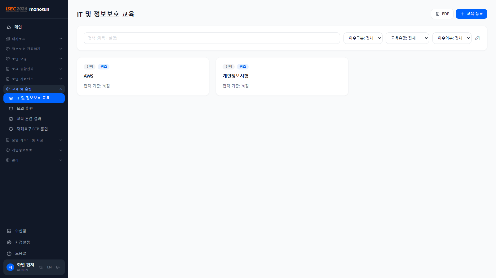

### 교육 과정 등록 (MANAGER 이상)

1. **교육 및 훈련 > IT 및 정보보호 교육** 이동
2. **+ 교육 등록** 버튼 클릭
3. 교육명, 콘텐츠 유형(영상/문서 등), 콘텐츠 URL, 합격 기준 점수, 필수 여부 입력
4. 퀴즈 문항을 직접 추가하거나 **문제은행에서 가져오기**로 불러오기
   - 분류·난이도·검색으로 문항을 찾아 여러 개를 선택한 뒤 **선택한 N개 문항 추가** — 선택한 문항은 모두 추가됩니다(문제 텍스트가 같은 문항도 각각 추가)
   - 난이도별 갯수를 지정해 **랜덤 선택**할 수도 있습니다
   - 문항의 **정답은 A~E 버튼으로 복수 지정**할 수 있습니다. 보기는 A~E(최대 5지선다)까지 입력할 수 있고, C~E는 내용을 입력해야 정답으로 지정됩니다. 정답을 하나도 고르지 않은 문항이 있으면 저장되지 않습니다
5. **저장**

### 교육 검색 · 필터

목록 상단에서 원하는 교육만 추려 볼 수 있습니다.

| 필터 | 내용 |
|------|------|
| **검색어** | 교육명과 **설명** 본문을 함께 검색합니다 |
| **이수구분** | 전체 / 필수 / 선택 |
| **교육유형** | 전체 / 영상 / 문서 / 퀴즈 |
| **이수여부** | 전체 / 이수 / 미이수 (본인 기준) |

- 필터를 걸면 오른쪽에 결과 건수가 표시되고, **초기화** 버튼으로 모두 해제합니다.
- 검색어는 입력을 멈추면 자동으로 조회됩니다.

### 교육 이수

1. 교육 카드 클릭 → 상세 화면에서 교육 콘텐츠 학습
2. 퀴즈 응시 → 합격 기준 점수 이상이면 이수 완료
3. 불합격 시 **오답 리뷰**로 틀린 문항과 해설을 확인하고 재응시할 수 있습니다
4. 이수 완료된 교육 카드에는 ✓ 이수 배지와 내 점수가 표시됩니다

### PDF 다운로드

우상단 **PDF** 버튼으로 교육 과정 목록을 PDF 파일로 내려받을 수 있습니다 (MANAGER 이상).

### 교육·훈련 결과

**교육 및 훈련 > 교육·훈련 결과** 메뉴에서 교육 이수 현황과 모의 훈련 결과를 탭으로 구분하여 조회합니다.

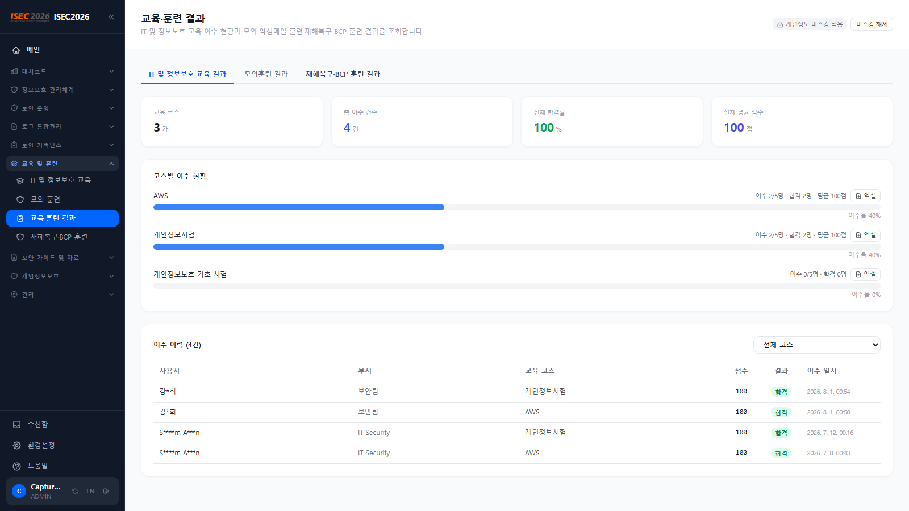

- **교육 결과 탭**: 과정별·임직원별 이수 여부, 점수, 이수일 조회
- **모의 훈련 탭**: 캠페인별 발송/열람/클릭/신고 현황 조회

---

## 14. 모의 훈련 (피싱)

임직원 대상 피싱 이메일 모의 훈련 캠페인을 관리합니다.

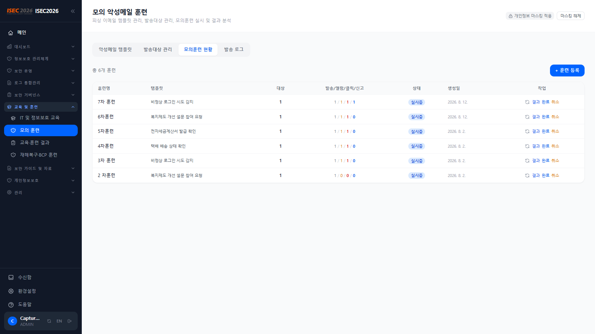

### 캠페인 생성

1. **교육 및 훈련 > 모의 훈련** 메뉴 이동
2. **+ 캠페인 생성** 버튼 클릭
3. 캠페인명, 발송일시, 대상자 목록, 피싱 템플릿 선택
4. **저장 및 예약**

### 발송 처리 결과 (v1.8.0)

훈련 메일이 대상자에게 **실제로 전달되었는지**를 대상자별로 확인합니다.

| 항목 | 설명 |
|------|------|
| 캠페인 / 수신자 / 부서 | 어느 캠페인의 누구에게 발송했는지 |
| 발송 상태 | **성공(SUCCESS)** / **실패(FAILED)** |
| 실패 사유 | 발송에 실패한 경우 원인 (예: 메일서버 인증 실패, 존재하지 않는 주소) |
| 발송 / 열람 / 클릭 시각 | 발송 이후 대상자의 반응 이력 |

> 발송이 실패한 대상자는 훈련 결과 집계에서 오해를 부를 수 있으므로, 캠페인 실시 후 발송 처리 결과를 먼저 확인하는 것을 권장합니다. 실패가 많다면 **관리 > 설정관리 > 메일서버(SMTP) 설정**의 연결 테스트를 확인하세요.

---

## 15. 보안 솔루션 연동

외부 보안 솔루션(SIEM, EDR 등)으로부터 이벤트를 수신하고 조회합니다.

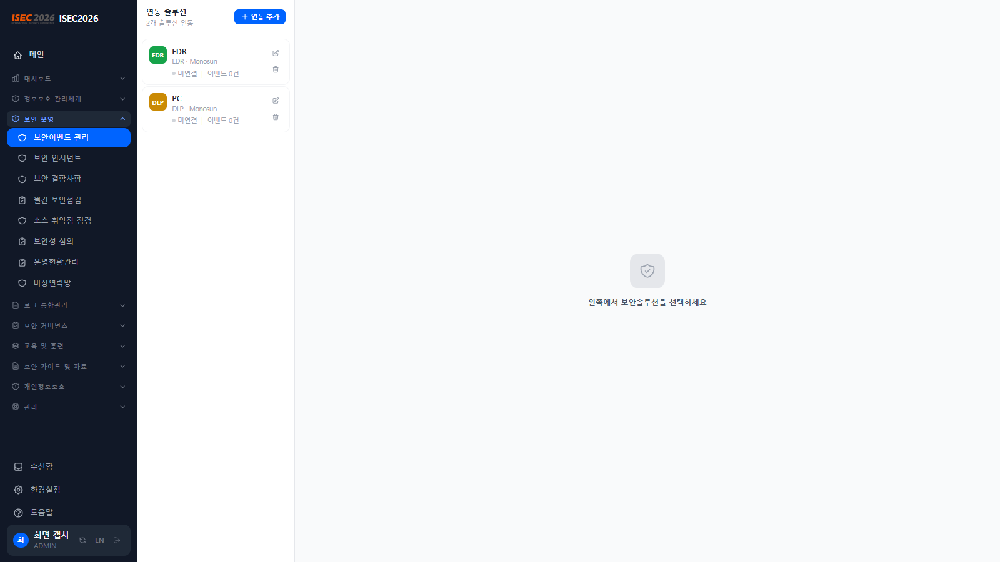

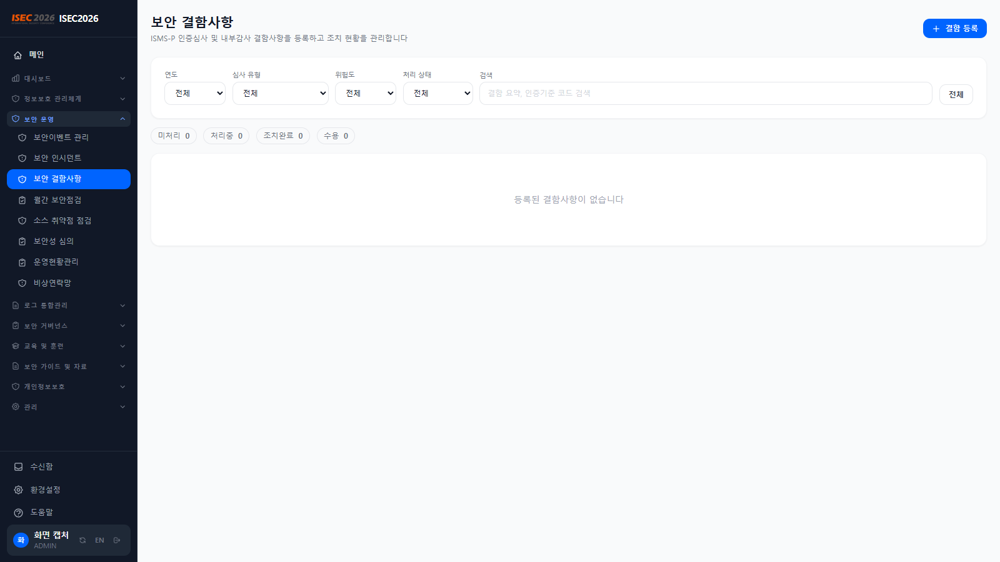

---

## 16. 로그 통합관리

개인정보처리시스템·AD·NAC·망연계 로그를 통합 조회하고 검색합니다.

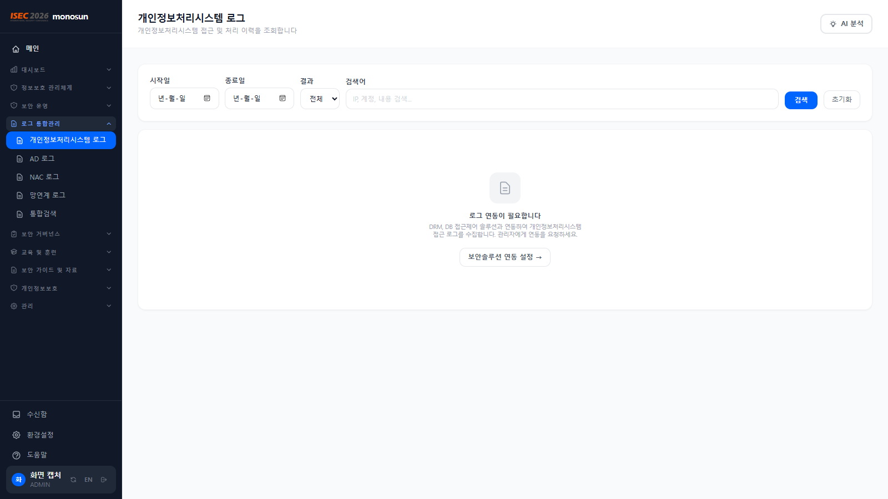

### 메뉴 구성

| 메뉴 | 설명 |
|------|------|
| 개인정보처리시스템 로그 | 개인정보 조회·처리 이력 로그 |
| AD 로그 | Active Directory 인증·계정 로그 |
| NAC 로그 | 네트워크 접근제어 로그 |
| 망연계 로그 | 망간 자료 전송 로그 |
| 통합검색 | 전체 로그 유형 대상 키워드 통합 검색 |

### 로그 조회

1. **로그 통합관리** 그룹에서 로그 유형 메뉴 선택
2. 시작일/종료일, 결과(성공/실패), 검색어(IP·계정·내용)로 필터링
3. **검색** 클릭 — **초기화** 버튼으로 필터를 되돌립니다

### AI 분석

우상단 **AI 분석** 버튼을 켜면 조회된 로그에 대한 AI 기반 이상 징후 분석 패널이 표시됩니다.
(AI 분석은 **설정관리 > AI 설정**에서 API 키가 등록된 경우 사용 가능합니다)

---

## 17. 알림

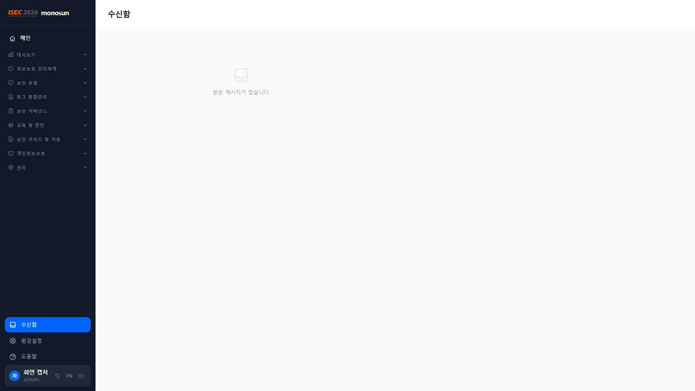

### 알림 확인

- 사이드바 하단의 **수신함** 메뉴에서 미확인 알림을 확인합니다 (미확인 수 배지 표시)
- 알림 클릭 시 해당 항목으로 이동

### 수신함 비우기

- **환경설정 > 계정 탭 > 수신함**에서 수신함의 모든 메시지를 비울 수 있습니다

---

## 18. 개인정보보호

개인정보 라이프사이클(수집 → 이용·제공 → 위탁 → 보유 → 파기) 전반과 정보주체 권리행사·유출대응·보호조치를 관리합니다.

좌측 메뉴는 라이프사이클 순서로 배치되어 있습니다.

| 순서 | 메뉴 | 절 |
|------|------|-----|
| 1 | 개인정보 처리현황 | [18.5](#185-개인정보-처리현황) |
| 2 | 개인정보 파일관리 | [18.6](#186-개인정보-파일관리) |
| 3 | 개인정보 수집·이용 관리 | [18.7](#187-개인정보-수집이용-관리) |
| 4 | 개인정보 제공관리 | [18.8](#188-개인정보-제공관리) |
| 5 | 수탁사 관리 | [18.1](#181-수탁사-관리) |
| 6 | 수탁사 점검 | [18.3](#183-수탁사-점검) |
| 7 | 개인정보 보유기간 관리 | [18.9](#189-개인정보-보유기간-관리) |
| 8 | 개인정보 파기관리 | [18.10](#1810-개인정보-파기관리) |
| 9 | 개인정보 영향평가(DPIA) | [18.11](#1811-개인정보-영향평가dpia) |
| 10 | 개인정보 유출관리 | [18.12](#1812-개인정보-유출관리) |
| 11 | 정보주체 권리행사 관리 | [18.13](#1813-정보주체-권리행사-관리) |
| 12 | 개인정보 보호조치 관리 | [18.14](#1814-개인정보-보호조치-관리) |
| 13 | 법령준수관리 | [18.4](#184-법령준수관리) |
| 14 | 개인정보 현황보고서 | [18.15](#1815-개인정보-현황보고서) |

> 절 번호는 문서 작성 순서이며 메뉴 순서와 다릅니다. 위 표의 "순서"가 실제 화면 배치입니다.

모든 화면은 공통 조작 방식을 따릅니다.

- 목록 상단에 **요약 통계**, 그 아래 **검색어·상태 필터**가 있습니다.
- 우상단 **등록** 버튼으로 새 항목을 추가하고, **목록의 행을 클릭하면 수정** 모달이 열립니다.
- 행 오른쪽 **삭제** 버튼으로 개별 삭제합니다(확인 후 삭제, 되돌릴 수 없음).
- 등록·수정·삭제는 MANAGER 이상 또는 RBAC에서 해당 메뉴 쓰기 권한이 있는 사용자만 가능합니다.

### 18.1 수탁사 관리

개인정보 처리 업무를 위탁한 수탁사 목록과 연도별 점검 이력을 등록·관리합니다.

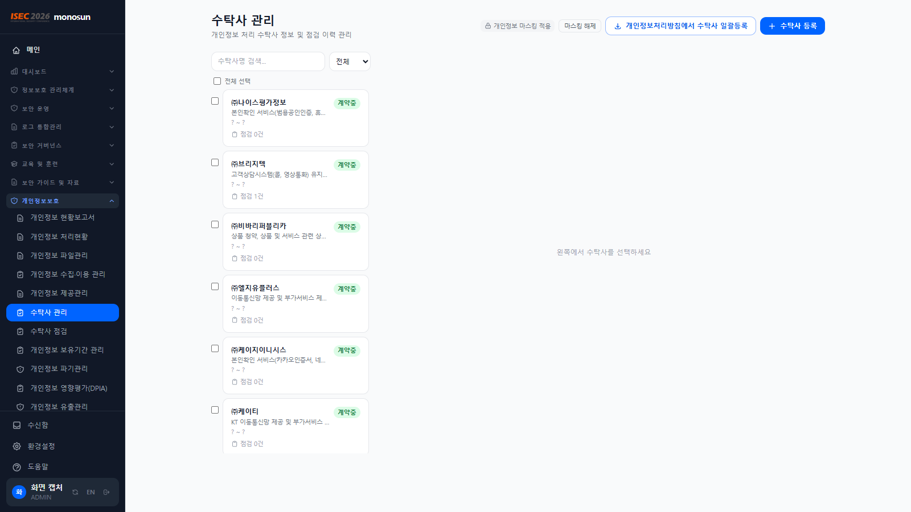

#### 화면 구성

| 영역 | 설명 |
|------|------|
| 왼쪽 패널 | 수탁사 목록 (이름 검색·상태 필터 제공) |
| 오른쪽 패널 | 선택한 수탁사의 기본 정보 및 연도별 점검 이력 |

#### 수탁사 등록

1. **개인정보보호 > 수탁사 관리** 이동
2. 우상단 **+ 수탁사 등록** 버튼 클릭
3. 아래 항목 입력:
   - 수탁사명 (필수), 사업자번호, 대표자명
   - 위탁 업무 (예: 고객센터 운영, 배송 서비스 등)
   - **재수탁사** — 수탁사가 업무를 재위탁한 업체가 있는 경우 입력
   - 계약 시작일 / 종료일
   - 담당자명, 연락처, 이메일
   - 상태: **계약중** / **종료**
   - 비고
4. **저장** 클릭

#### 개인정보처리방침에서 수탁사 일괄등록 (v1.8.0)

수탁사를 한 건씩 입력하는 대신, **개인정보처리방침 페이지의 위탁 표를 그대로 읽어와** 여러 건을 한 번에 등록할 수 있습니다.

1. **개인정보보호 > 수탁사 관리** 이동
2. 우상단 **개인정보처리방침에서 수탁사 일괄등록** 버튼 클릭 (수탁사 등록 버튼 왼쪽)
3. 팝업에 **개인정보처리방침 URL**을 입력하고 **불러오기** 클릭
   - 서버가 해당 페이지를 읽어 위탁 표에서 **수탁사 · 위탁업무 · 재수탁사**를 추출합니다
   - 개인정보 **제3자 제공** 표는 위탁 표와 구분하여 제외됩니다
4. 추출된 목록을 **확인하고 필요하면 수정**합니다
   - 각 칸을 직접 편집할 수 있고, 필요 없는 행은 휴지통 아이콘으로 삭제하거나 체크를 해제합니다
   - **이미 등록된 수탁사**는 주황색으로 표시되고 기본 선택에서 제외됩니다
5. **선택한 N건 일괄등록** 클릭 → 선택한 수탁사가 한 번에 등록됩니다
   - 이름이 같은 수탁사는 서버에서도 중복 등록을 차단하므로, 방침이 갱신될 때 다시 불러와도 안전합니다
   - 등록 결과(등록 건수 / 중복으로 건너뛴 수탁사)가 안내됩니다

> **참고**: 위탁 표를 자바스크립트로 그리는 방침 페이지는 인식하지 못할 수 있습니다. 이 경우 안내 메시지가 표시되며, 수기로 등록하면 됩니다.

> **최근 URL 이력 (v1.9.0)**: 성공적으로 불러온 방침 URL을 최근 8개까지 기억합니다. 팝업을 다시 열면 가장 최근 URL이 자동으로 채워지고, URL 칩을 클릭하면 즉시 재조회합니다. 칩의 × 버튼으로 개별 이력을 삭제할 수 있습니다.

#### 선택(일괄) 삭제 (v1.9.0)

- 수탁사 목록 상단의 **전체 선택** 체크박스와 각 항목의 체크박스로 여러 수탁사를 선택한 뒤, **선택 삭제 (N)** 버튼으로 한 번에 삭제할 수 있습니다.
- 검색·상태 필터로 숨겨진 항목은 선택 대상에서 제외되어, 화면에 보이는 항목만 삭제합니다.
- 삭제 시 각 수탁사의 **모든 점검 이력이 함께 삭제**된다는 확인 창이 표시됩니다.

#### 연도별 점검 등록

수탁사 점검 시스템과 연동하여 연도별 점검을 생성하고 관리합니다.

1. 왼쪽 목록에서 수탁사 선택
2. 오른쪽 **점검 이력** 섹션의 **+ 점검 등록** 클릭
3. 아래 항목 입력:
   - **점검 연도** (필수): 동일 연도·수탁사 조합이 이미 존재하면 해당 점검을 불러옵니다
   - 점검일, 점검자, 상태 (계획 / 진행중 / 완료), 비고
4. **등록** 클릭 → 점검이 생성되고 결과 보기 모달이 자동으로 열립니다

#### 점검 결과 보기

등록된 점검 카드의 **결과 보기** 버튼을 클릭하면 해당 연도 점검의 세부 결과를 인라인 모달로 확인합니다.

모달에 표시되는 정보:

| 항목 | 설명 |
|------|------|
| 헤더 | 점검 연도, 상태 배지, 점검일, 점검자 |
| 통계 바 | 통과 / 미흡 / 해당없음 / 미점검 항목 수 및 진행 바 |
| 결과 테이블 | 카테고리별로 그룹화된 점검항목과 각 결과 |
| 하단 버튼 | **수탁사 점검에서 결과 수정** — 수탁사 점검 페이지로 이동하여 상세 결과를 입력합니다 |

결과 배지 색상:

| 배지 | 의미 |
|------|------|
| 통과 (초록) | 점검 기준 충족 |
| 미흡 (빨강) | 점검 기준 미충족 |
| 해당없음 (회색) | 해당 항목 적용 불가 |
| 미점검 (연회색) | 아직 결과 미입력 |

#### 점검 이력 카드

각 연도 점검 카드에는 다음 정보와 액션 버튼이 표시됩니다:

- **연도 + 상태 배지**: 계획(파랑) / 진행중(노랑) / 완료(초록)
- **점검일 / 점검자**
- **진행률 바**: 통과·미흡·해당없음·미점검 비율을 색상으로 표시
- **결과 보기**: 세부 결과 모달 열기
- **수정**: 점검 기본 정보(날짜·점검자·상태·비고) 수정
- **삭제**: 해당 연도 점검 및 모든 결과 삭제

> 수탁사를 삭제하면 해당 수탁사의 모든 점검 이력과 결과가 함께 삭제됩니다.

---

### 18.2 수탁사 점검항목 관리 (코드관리로 이전, v1.7.1)

> **v1.7.1**부터 별도의 "수탁사 점검항목 관리" 메뉴는 제거되었습니다. 수탁사 점검항목의 기본 템플릿은 **관리 > 코드관리 > 수탁사 기본점검항목** 탭에서 관리합니다(분야·항목명·점검방법·점검기준·정렬 순서 추가/수정/삭제).

- 기본 템플릿(개인정보보호법 기준 20개 항목)은 앱 최초 기동 시 자동으로 채워집니다.
- **새 수탁사 점검을 등록하면** 코드관리에 등록된 기본점검항목이 해당 점검의 결과 입력 항목으로 자동 반영됩니다.

---

### 18.3 수탁사 점검

연도별·수탁사별로 각 점검항목에 대한 실제 이행 결과를 입력·관리합니다.

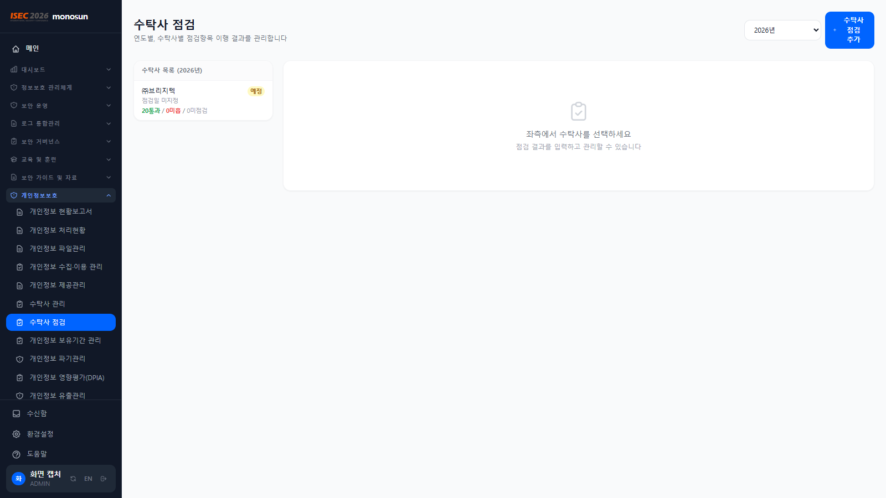

#### 화면 구성

| 영역 | 설명 |
|------|------|
| 상단 연도 선택 | 점검 연도를 선택합니다 |
| 왼쪽 패널 | 선택 연도의 수탁사 목록과 통과/미흡/미점검 요약 |
| 오른쪽 패널 | 선택한 수탁사의 점검 헤더 정보 + 항목별 결과 입력 |

#### 결과 입력

1. **개인정보보호 > 수탁사 점검** 이동
2. 상단 연도 드롭다운에서 점검 연도 선택
3. 왼쪽 목록에서 수탁사 선택
4. 오른쪽에서 각 점검항목별 결과 버튼 클릭:

| 버튼 | 의미 |
|------|------|
| **통과** (초록) | 점검 기준 충족 |
| **미흡** (빨강) | 점검 기준 미충족 |
| **해당없음** (회색) | 해당 항목 적용 불가 |
| **미점검** (노랑) | 결과 미입력 상태 |

- **미흡** 선택 시 하단에 메모 입력란이 자동으로 표시됩니다.
- 메모 입력란 포커스 해제 시 자동 저장됩니다.
- 결과를 클릭할 때마다 즉시 서버에 저장됩니다.

#### 검색 필터

점검항목이 많을 때 **항목명·카테고리 검색** 입력란에 키워드를 입력하여 해당 항목만 표시할 수 있습니다.

- 필터 적용 시 `(N/전체건)` 형태로 필터된 항목 수가 헤더에 표시됩니다.
- 검색어를 지우면 전체 목록으로 돌아옵니다.

#### 일괄 처리 버튼

점검항목 테이블 헤더의 우측에 두 가지 일괄 처리 버튼이 있습니다:

| 버튼 | 동작 |
|------|------|
| **모두 통과** (초록) | 모든 점검항목을 "통과"로 일괄 설정 |
| **점검 초기화** (회색) | 모든 점검항목을 "미점검"으로 초기화하고 메모 삭제 |

> 두 버튼 모두 실행 전 확인 다이얼로그가 표시됩니다.

#### 진행률 표시

선택한 수탁사의 점검 헤더 카드에 진행률이 실시간으로 표시됩니다:

- **진행률 바**: 전체 항목 중 통과/미흡/해당없음 비율을 색상으로 표시
- **통계 요약**: 통과 N / 미흡 N / 해당없음 N / 미점검 N

#### 점검 추가

1. 상단 **+ 수탁사 점검 추가** 버튼 클릭
2. 수탁사 선택, 점검 연도, 점검일(기본값 오늘), 점검자, 상태, 비고 입력
3. **추가** 클릭 → 코드관리의 수탁사 기본점검항목으로 결과 행이 자동 생성됩니다

> **건별 이력 (v1.7.1)** — 점검은 등록할 때마다 **별도 이력으로 누적**됩니다. 같은 수탁사·연도라도 기존 점검을 덮어쓰지 않으므로, 재점검·분기별 점검 등을 각각의 이력으로 보관할 수 있습니다. 좌측 목록에서 **점검일**로 각 점검을 구분합니다.

#### 항목 동기화

코드관리에서 기본점검항목이 추가된 경우, 오른쪽 패널 헤더의 **항목 동기화** 버튼을 클릭하여 새 항목을 현재 점검에 추가합니다.

---

### 18.4 법령준수관리

업종별로 준수해야 할 법령(법령·시행령·시행규칙·규정·고시 등)을 조회하고, 선택한 법령을 조문(조·항) 단위로 Excel 다운로드하여 준수 여부를 관리합니다.

#### 주요 기능

| 기능 | 설명 |
|------|------|
| 업종 카테고리 필터 | 금융·핀테크 / 통신 / 전자상거래·플랫폼 / 클라우드·SaaS / 기타 업종 |
| 키워드 검색 | 업종명 또는 법령명·소관부처로 실시간 검색 |
| 우리 업종만 보기 | 설정관리 > 업종 설정에서 지정한 업종만 필터링 |
| 법령 선택 | 체크박스로 개별 법령 또는 업종 전체 선택 |
| Excel 다운로드 | 선택한 법령을 시트별 조·항 내용 포함하여 Excel 저장 |

#### 법령 선택 및 다운로드

1. **개인정보보호 > 법령준수관리** 이동
2. 카테고리 버튼 또는 검색창으로 원하는 업종 필터링
3. 업종 카드를 클릭하여 펼친 후 법령 목록에서 체크박스 선택
   - 업종 헤더 체크박스로 해당 업종 전체 법령 일괄 선택 가능
4. 우상단 **선택 법령 Excel 다운로드** 버튼 클릭

#### Excel 구성

| 시트 | 내용 |
|------|------|
| 법령목록 | 선택된 법령 전체 요약 (업종·구분·법령명·소관부처·링크·**판단**) |
| 개인정보 보호법 등 각 법령 시트 | 조 번호·조 제목·항 번호·내 용·**판단** 컬럼 |

- **판단** 컬럼은 준수/미준수/해당없음/검토필요 중 해당 항목을 직접 입력하는 자유 입력 셀입니다.
- 각 법령 시트에는 해당 법령의 주요 준수 조문이 행 단위로 표시됩니다.
- 시행령·규정·고시 등 하위 법규도 개별 시트로 분리됩니다.

#### 업종 설정

**설정관리 > 업종 설정** 탭에서 회사 업종을 선택하면 법령준수관리 화면에 **우리 업종만** 필터 버튼이 활성화됩니다.

**업종 내 개별 법령 선택 (v1.11.0)**

업종을 선택한 뒤, 각 업종에 딸린 법령을 **개별로 켜고 끌 수 있습니다.**

1. 업종 행 오른쪽의 펼치기(⌄) 버튼을 눌러 해당 업종의 법령 목록을 엽니다.
2. 법령별 체크박스로 필요한 법령만 선택합니다. **전체 법령 선택**으로 일괄 선택/해제할 수 있습니다.
3. 부분 선택된 업종은 `법령 3/15개`처럼 선택 개수를 표시합니다.

- 부분 선택된 업종만 저장되므로(전체 선택은 기본값), 이후 법령이 추가돼도 자동으로 포함됩니다.
- **법령준수관리(우리 업종만 보기)** 와 **대시보드 법령 개정 위젯**이 이 개별 선택을 반영합니다.

**목록에 없는 법령·고시 검색 추가 (v1.15.0)**

기본 제공 목록에 없는 법령·고시를 **국가법령정보센터(law.go.kr)에서 검색해 직접 추가**할 수 있습니다.

1. 업종을 선택하고 펼치기(⌄) 버튼으로 법령 목록을 엽니다.
2. 목록 하단의 **법령·고시 검색 추가**를 누르고 법령명·고시명을 입력해 **검색**합니다(법령·행정규칙 고시 동시 조회).
3. 검색 결과에서 **추가**를 누르면 해당 업종 법령 목록에 편입되고 자동으로 선택됩니다. 추가된 법령은 **추가** 뱃지로 구분되며 **×** 버튼으로 삭제할 수 있습니다.
4. **저장**을 누르면 추가한 법령이 보관됩니다.

- 추가한 법령은 **법령준수관리**의 해당 업종에 함께 표시되고, **법령검토**에서 국가법령정보센터 실시간 조문 조회가 그대로 동작합니다.
- 회사 전체에 공통 적용되는 법령은 **업종 공통 > 일반법인(전 업종 공통)** 항목에 추가합니다.
- 실시간 검색에는 **법제처 API 키**(설정관리 > API 연동 탭)가 필요합니다.

---

### 18.5 개인정보 처리현황

개인정보를 처리하는 **업무 단위**로 처리 목적·항목·근거를 등록합니다. 개인정보 처리방침 작성과 ISMS-P 심사의 기초 자료가 됩니다.

#### 입력 항목

| 항목 | 설명 |
|------|------|
| 처리업무명 | 업무 단위 이름 (예: 셀프개통, 고객센터, 배송, 정산, 마케팅) |
| 처리부서 | 해당 업무를 수행하는 부서 |
| 처리목적 | 개인정보를 처리하는 목적 |
| 개인정보 항목 | 처리하는 항목 (예: 성명, 휴대전화번호, 주소) |
| 보유기간 | 예: 수집일로부터 3년 |
| 처리근거 | 동의 / 계약 이행 / 법령상 의무 등 |
| 처리시스템 | **자산관리에 등록된 서비스·애플리케이션 자산에서 선택**하거나 직접 입력합니다 (아래 참고) |
| 개인정보 라이프사이클 | 해당 단계를 쉼표로 구분 (예: `수집,보유,이용,제공,파기`) |
| 업무흐름도 | 개인정보가 흐르는 경로를 단계별로 기술 |
| 상태 | 운영중 / 중단 |

#### 처리시스템 — 자산 연계

`처리시스템` 입력란을 클릭하면 **자산관리에 등록된 자산 목록**이 나타납니다. 목록에서 고르거나, 목록에 없으면 **직접 입력**할 수 있습니다.

- 목록에 나오는 자산은 **자산유형이 「서비스」이고 유형이 「애플리케이션」인 사용 중 자산**입니다.
- 목록에 원하는 시스템이 없다면 **자산 관리**에서 위 조건으로 자산을 먼저 등록하세요.
- 파일관리의 `운영 시스템`도 같은 목록을 사용합니다. **두 값의 이름이 같아야** 전체 흐름 지도에서 처리업무와 개인정보파일이 연결됩니다.

> 자산 목록에서 고르면 이름이 정확히 일치하므로 흐름 지도 연결이 끊기지 않습니다. 직접 입력할 때는 표기를 맞춰 주세요.

#### 제공 정보 등록·수정 (제3자 제공 · 공동이용 · 국외이전)

처리업무에서 외부로 나가는 개인정보를 **처리현황 화면에서 바로** 등록·수정할 수 있습니다. 제공관리 메뉴로 이동하지 않아도 됩니다.

**여는 방법 두 가지**

- 목록에서 처리업무 행 오른쪽의 **제공** 버튼
- 해당 업무의 **흐름도**를 연 뒤 「이 업무에서 나가는 개인정보」의 **제공 정보 관리** 버튼

**등록 방법**

1. **제공 등록** 버튼을 누릅니다.
2. **제공 유형**을 고릅니다 — 제3자 제공 / 공동이용 / **국외이전**.
   - 국외이전을 고르면 **이전 국가** 입력란이 나타나며 필수입니다.
3. 제공받는 자, 제공 항목, 제공목적, 제공근거, 제공받는 자의 보유기간, 제공 방법, 계약 정보를 입력합니다.
   - **처리업무의 개인정보 항목 가져오기**를 누르면 해당 처리업무에 등록된 개인정보 항목이 제공 항목에 채워집니다.
4. 저장하면 목록에 추가됩니다. 기존 항목은 **수정**·**삭제** 버튼으로 관리합니다.

> 여기서 등록한 제공은 **제공관리** 메뉴에도 함께 나타나며, 해당 처리업무에 자동으로 연계됩니다.
> 반대로 제공관리에서 등록할 때는 **연계 처리업무**를 직접 지정해야 이 화면과 흐름도에 표시됩니다.

#### 개인정보 흐름도 (업무별)

목록에서 처리업무 행 오른쪽의 **흐름도** 버튼을 누르면 해당 업무의 개인정보 흐름을 그래프로 봅니다.

| 구성 | 내용 |
|------|------|
| 라이프사이클 | 수집 → 보유 → 이용 → 제공 → 파기 중 **해당 단계만 강조**됩니다. `라이프사이클` 항목에 입력한 값을 따릅니다. |
| 업무 흐름 | `업무흐름도`에 입력한 내용을 **단계 노드로 분해**해 순서대로 그립니다. |
| 이 업무에서 나가는 개인정보 | 제공관리에서 **연계 처리업무**를 이 업무로 지정한 제공처가 표시됩니다. |
| 처리 정보 | 개인정보 항목 · 처리목적 · 보유기간 · 처리근거 |

> **흐름도로 그려지려면** 업무흐름도의 단계를 `→` 또는 줄바꿈으로 구분해 입력하세요.
> 예: `1) 가입신청 접수 → 2) 본인인증 → 3) 개통 처리 → 4) 보유기간 경과 시 파기`
> 구분자가 없으면 입력한 텍스트를 그대로 보여줍니다. 앞의 번호(`1)`, `①`, `-`)는 자동으로 제거됩니다.

#### 전체 흐름 지도

화면 우상단 **전체 흐름 지도** 버튼을 누르면 조직 전체의 개인정보 흐름을 한 장으로 봅니다. ISMS-P 심사에서 요구하는 개인정보 흐름 파악에 사용합니다.

```
[처리업무] ──▶ [시스템 · 개인정보파일] ──▶ [제공 · 국외이전]
```

| 연결 | 기준 |
|------|------|
| 처리업무 → 개인정보파일 | **시스템명이 같을 때** 연결합니다. 처리현황의 `처리시스템`과 파일관리의 `운영 시스템`을 동일하게 입력하세요. |
| 처리업무 → 제공처 | 제공관리의 **연계 처리업무** 지정을 따릅니다. |

**누락 점검** — 지도 아래에 연결되지 않은 항목이 별도로 표시됩니다.

- **처리업무에 연결되지 않은 개인정보파일** — 보유 중인데 처리업무가 없다면 처리 근거가 불명확한 개인정보일 수 있습니다. 시스템명을 맞추거나 처리업무를 등록하세요.
- **처리업무에 연결되지 않은 제공** — 제공관리에서 연계 처리업무를 지정하면 지도에 함께 표시됩니다.
- **처리위탁 — 수탁사** — 수탁사는 처리업무와 연결하는 항목이 없어 목록으로만 표시됩니다.

---

### 18.6 개인정보 파일관리

**개인정보파일대장**을 시스템화한 화면입니다. 파일(데이터셋) 단위로 관리합니다.

#### 입력 항목

| 항목 | 설명 |
|------|------|
| 개인정보파일명 | 예: 가입자정보, 배송정보, 본인인증정보, VOC, 마케팅 |
| 담당부서 | 파일을 보유·운영하는 부서 |
| 운영 시스템 | 처리현황의 `처리시스템`과 같은 **서비스·애플리케이션 자산 목록**에서 선택하거나 직접 입력합니다 |
| DB 테이블 | 실제 저장 테이블명 (예: `tb_subscriber`) |
| 개인정보 항목 | 파일에 포함된 항목 |
| 보유기간 / 보유 건수 | 보유 정책과 현재 규모 |
| 민감정보 포함 | 체크 시 목록에 표시되고 요약 통계에 집계됩니다 |
| 고유식별정보 포함 | 체크 시 목록에 표시되고 요약 통계에 집계됩니다 |

> 민감정보·고유식별정보 포함 파일은 상단 요약에 별도 집계되어 안전성 확보조치 대상을 빠르게 식별할 수 있습니다.

---

### 18.7 개인정보 수집·이용 관리

수집동의서를 **버전 단위**로 관리합니다.

#### 입력 항목

| 항목 | 설명 |
|------|------|
| 동의서명 | 예: 회원가입 개인정보 수집·이용 동의 |
| 버전 | **읽기 전용** — 최초 1.0으로 시작하며 버전이력으로만 변경됩니다 (v1.11.0) |
| 필수/선택 | 필수 동의 / 선택 동의 구분 |
| 수집 채널·화면 | 예: 웹 회원가입 페이지 |
| 수집 항목 / 이용목적 / 처리근거 | 동의받는 내용 |
| 보유·이용기간 | 동의서에 고지한 기간 |
| 시행일 | 해당 버전이 적용된 날짜 |
| 상태 | 초안 / 시행중 / 만료 |
| 동의서 본문 | 실제 고지 문구 |

#### 동의서 개정

동의 내용이 바뀌면 **기존 버전을 수정하지 말고 새 버전을 만드세요.** 과거에 어떤 내용으로 동의받았는지가 남아야 합니다.
개정본은 기존 내용을 복사해 **초안** 상태로 생성되며, 내용을 고친 뒤 상태를 **시행중**으로 바꾸고 이전 버전은 **만료**로 변경합니다.

#### 버전 자동 관리 (v1.11.0)

버전은 세부항목에서 **수동으로 수정할 수 없으며**, 목록 행의 **버전이력** 버튼에서만 관리됩니다.

- 동의서를 처음 등록하면 버전은 항상 **1.0**입니다.
- 버전이력에서 **새 버전 추가**(변경사유·시행일·첨부파일)를 하면 버전이 **자동으로 증가**합니다(1.0 → 1.1 → …).
- 버전이력을 **삭제**하면 동의서의 현재 버전이 **직전(하위) 버전으로 되돌아갑니다.** 남은 이력이 없으면 1.0으로 복귀합니다.
- 각 버전이력에는 개정 동의서 원본·서명본 등 **파일을 첨부**하고 다시 내려받을 수 있습니다.

---

### 18.8 개인정보 제공관리

**제3자 제공·공동이용·국외이전**을 관리합니다. 처리위탁(수탁사 관리)과는 법적 성격이 다르므로 별도 화면으로 분리되어 있습니다.

#### 제공 유형

| 유형 | 설명 |
|------|------|
| 제3자 제공 | 제3자에게 개인정보를 제공 |
| 공동이용 | 둘 이상이 공동으로 개인정보를 이용 |
| 국외이전 | 국외의 제3자에게 이전 — **이전 국가**를 함께 입력합니다 |

#### 입력 항목

제공받는 자, 제공 항목·목적·근거, 제공받는 자의 보유기간, 제공 방법, 제공 계약 정보와 계약기간, 최초 제공일, 상태(제공중/종료)를 기록합니다.

---

### 18.9 개인정보 보유기간 관리

보유기간 **만료와 삭제 예정을 추적**합니다. 파기관리와 연계됩니다.

#### 입력 항목

| 항목 | 설명 |
|------|------|
| 관리 대상 | 개인정보파일명 또는 처리업무명 |
| 보유기간 / 보유근거 | 예: 수집일로부터 3년 / 전자상거래법 제6조(5년) |
| 보유 시작일 / 만료예정일 | 만료 D-day 계산의 기준 |
| 삭제(파기)예정일 | 만료 후 지체 없이 파기해야 합니다 |
| 연장사유 | 보유기간을 연장한 경우 근거를 기록 |
| 자동알림 / 알림 시점 | 만료 며칠 전에 알릴지 설정 (기본 30일) |
| 상태 | 보유중 / 연장 / 파기완료 |

#### 만료 현황 확인

목록의 **만료까지** 열에 남은 일수가 표시되며, 만료가 지났는데 파기되지 않은 항목은 `N일 경과`로 표시됩니다.
상단 요약에서 **30일 내 만료예정**과 **만료 경과·미파기** 건수를 바로 확인할 수 있습니다.

---

### 18.10 개인정보 파기관리

파기 **계획 → 승인 → 수행 → 증적**의 흐름을 관리합니다.

#### 입력 항목

| 항목 | 설명 |
|------|------|
| 파기계획명 / 파기대상 | 예: 2026년 상반기 만료 가입자정보 파기 |
| 연계 보유기간 항목 ID | 보유기간 관리 항목의 ID — 연계 시 자동 전이 대상이 됩니다 |
| 파기 개인정보 항목 / 파기 건수 | 파기 범위 |
| 파기방법 | DB 레코드 영구삭제 / 문서 파쇄 / 소각 등 |
| 파기예정일 / 실제 파기일 | 계획과 실적 |
| 파기 수행자 / 파기 승인자 / 승인일 | 책임 소재 |
| 승인 상태 | 승인대기 / 승인 / 반려 |
| 진행 상태 | 계획 / 진행중 / 파기완료 |
| 파기증적 | 결과 캡처·로그·확인서 등 증적의 위치와 내용 |

#### 보유기간 항목 자동 전이

**연계 보유기간 항목 ID**를 입력한 파기계획의 진행 상태를 **파기완료**로 저장하면, 해당 보유기간 항목의 상태가 자동으로 **파기완료**로 바뀝니다.
보유기간 관리와 파기관리가 따로 놀지 않도록 하는 연결 지점이며, 이 전이는 감사 로그에 기록됩니다.

---

### 18.11 개인정보 영향평가(DPIA)

개인정보 영향평가를 관리합니다. 공공기관 PIA뿐 아니라 민간의 자체 영향평가 용도로도 사용할 수 있습니다.

#### 입력 항목

| 항목 | 설명 |
|------|------|
| 영향평가명 / 평가 대상 시스템 | 평가 범위 |
| 담당부서 / 평가자(수행기관) | 수행 주체 |
| 대상 개인정보 항목 / 대상 정보주체 수 | 평가 규모 |
| 평가일 | 평가 수행일 |
| 체크리스트 결과 | 평가 항목별 점검 결과 |
| 종합 위험도 | 높음 / 보통 / 낮음 |
| 개선계획 / 개선 완료 예정일 | 도출된 개선 과제 |
| 완료보고 / 완료일 | 최종 결과 |
| 진행 상태 | 대상선정 / 평가중 / 개선중 / 완료 |

#### 보고서 첨부파일 (v1.12.0)

영향평가 결과보고서 등 산출물 문서를 평가 건별로 첨부합니다. 목록 행 오른쪽의 **첨부** 버튼을 누르면 첨부파일 창이 열립니다.

- **파일 추가**로 **구분**(결과보고서 / 개선이행 / 체크리스트 / 기타), **문서 제목**, 파일을 지정해 올립니다. 문서 제목을 비우면 파일명이 사용됩니다.
- 한 평가에 **여러 개의 파일**을 첨부할 수 있습니다. 평가 → 개선 → 완료 단계별 산출물을 함께 보관하세요.
- 첨부 가능한 형식은 PDF·이미지·문서(doc/xls/ppt)·zip 입니다.
- 파일명을 클릭하면 내려받고, **삭제**로 개별 제거합니다. 목록의 **첨부** 컬럼에 건수가 표시됩니다.
- 등록·삭제는 관리자/담당자 권한이 필요하며, 조회·다운로드는 열람 권한이 있으면 가능합니다.

> 영향평가를 삭제하면 첨부된 파일도 함께 삭제됩니다.

---

### 18.12 개인정보 유출관리

개인정보 **유출사고**를 관리합니다. 보안 인시던트(7장)와는 신고 의무와 절차가 달라 별도로 운영합니다.

#### 입력 항목

| 항목 | 설명 |
|------|------|
| 사고명 | 사고 식별 이름 |
| 유출 발생일시 / 인지일시 | **인지일시가 신고기한의 기산점**입니다 |
| 신고기한 | 비워두면 **인지일시 + 72시간**으로 자동 계산됩니다 |
| 유출 정보주체 수 / 유출 개인정보 항목 | 사고 규모 |
| 유출 경로·원인 | 원인 분석 |
| 정보주체 통지 / 통지일 / 통지 방법 | 통지 이행 내역 |
| 관계기관 신고 / 신고 기관 / 신고일 | 예: 개인정보보호위원회, KISA |
| 조사결과 / 재발방지 대책 | 사후 조치 |
| 진행 상태 | 인지 / 조사중 / 통지·신고완료 / 종결 |

#### 신고기한 관리

목록의 **신고기한** 열에 남은 시간이 표시되며, 신고하지 않은 채 기한이 지나면 `기한 경과`로 표시됩니다.
상단 요약의 **신고기한 경과** 건수는 관계기관 신고가 완료되지 않은 사고만 집계합니다.

> 인지일시를 입력하지 않으면 신고기한이 계산되지 않습니다. 사고를 인지하면 인지일시부터 기록하세요.

---

### 18.13 정보주체 권리행사 관리

정보주체의 권리행사 요청을 접수부터 처리결과까지 관리합니다. ISMS-P 심사에서 자주 확인하는 항목입니다.

#### 요청 유형

열람 / 정정 / 삭제 / 처리정지 / 동의철회

#### 입력 항목

| 항목 | 설명 |
|------|------|
| 요청 유형 / 정보주체명 / 연락처 | 요청자 정보 |
| 접수 채널 | 예: 고객센터, 이메일, 웹 |
| 요청 내용 | 요청 상세 |
| 요청일(접수일) | **처리기한 산정의 기준** |
| 처리기한 | 비워두면 **요청일 + 10일**로 자동 산정됩니다 |
| 처리 담당자 / 처리 완료일 / 처리결과 | 처리 내역 |
| 거절 사유 | 거절한 경우 법적 근거를 함께 기록 |
| 처리 상태 | 접수 / 진행중 / 완료 / 거절 |

#### SLA 관리

- 미완료 건은 **처리기한까지 남은 일수**가 표시되고, 기한이 지나면 `기한 초과`로 표시됩니다.
- 완료·거절된 건은 **완료일이 기한을 넘겼는지**로 초과 여부를 판정합니다.
- 상태를 완료·거절로 저장할 때 처리 완료일이 비어 있으면 **오늘 날짜가 자동으로 채워집니다.**

---

### 18.14 개인정보 보호조치 관리

안전성 확보조치의 **관리현황**을 기록합니다. 원본 로그 조회는 [16. 로그 통합관리](#16-로그-통합관리)에서 하고, 이 화면은 점검·조치 결과를 남기는 용도입니다.

#### 보호조치 유형

접근권한 점검 / 권한회수 / 암호화 적용현황 / 접속기록 점검 / 출력물 관리 / 반출관리 / 휴면계정 관리

#### 입력 항목

| 항목 | 설명 |
|------|------|
| 보호조치 유형 / 조치·점검명 | 예: 2026년 3분기 개인정보처리시스템 접근권한 점검 |
| 대상 시스템 / 담당부서 | 범위와 주체 |
| 점검(조치)일 / 수행자 | 수행 내역 |
| 점검 대상 건수 / 조치 건수 | 권한회수·휴면전환 등 실제 조치 규모 |
| 점검·조치 결과 / 발견된 문제점 / 개선조치 내용 | 결과 기록 |
| 차기 점검 예정일 | 주기적 점검 관리 |
| 진행 상태 | 계획 / 진행중 / 완료 |

---

### 18.15 개인정보 현황보고서

개인정보보호 전 영역을 **자동 집계**합니다. 경영진 보고와 ISMS-P 심사 대응에 사용합니다.

**개인정보보호 > 개인정보 현황보고서**로 이동하면 조회 시점 기준으로 집계되며, 우상단 **새로고침**으로 다시 집계합니다. 9개 영역을 **그래프 중심**으로 배치해 스크롤 없이 전체 현황을 파악할 수 있습니다.

#### 화면 구성 (그래프)

| 구역 | 내용 |
|------|------|
| **즉시 조치 필요** | 만료 경과·신고기한 경과·처리기한 초과·미종결·미점검·DPIA 위험높음 중 **0이 아닌 항목만** 상단에 모아 표시(모두 0이면 "이상 없음") |
| **핵심 지표** | 개인정보파일 · 처리업무 · 수탁사 · 권리행사 총계를 큰 숫자로, 보조 수치를 한 줄로 |
| **이행률** | 수탁사 점검 · 파기 완료 · DPIA 완료 · 안전조치 완료를 **비율 막대(미터)** 로 표시. 90% 이상 녹색, 70% 이상 노란색, 미만은 빨간색이며 비율과 `완료/전체` 건수를 함께 표기 |
| **영역별 구성** | 처리업무·개인정보파일·제3자 제공·유출사고·보유기간·파기·권리행사를 **가로 누적 막대**로 구성비 표시(막대 아래 색상 범례 + 건수) |
| **유형별** | 권리행사 유형·안전조치 유형을 **건수 순 가로 막대**로 표시 |

- 막대에 마우스를 올리면 항목명·건수·비율이 툴팁으로 표시됩니다.
- 우상단 **표로 보기**를 누르면 같은 수치를 표로 확인할 수 있습니다(값 복사·검증용). 다시 누르면 그래프로 돌아옵니다.

#### PDF 다운로드

우상단 **PDF 다운로드** 버튼으로 보고서를 PDF로 내려받습니다 (MANAGER 이상).

- 파일명은 `개인정보-현황보고서-YYYYMMDD.pdf` 형식입니다.
- **화면과 같은 집계 결과**를 사용하므로 값이 항상 일치합니다.
- **화면에 보이는 그대로** 출력됩니다 — 즉시 조치 필요 → 핵심 지표 → 이행률 미터 → 영역별 누적 막대 → 유형별 막대 순서와 색상이 화면과 동일하며, 마지막 장에 **상세 수치 표**(화면의 '표로 보기')가 부록으로 붙습니다.
- 회사정보(설정관리 > 회사정보)가 등록되어 있으면 보고서 머리말에 함께 표시됩니다.
- 경영진 보고나 ISMS-P 심사 증적으로 그대로 제출할 수 있습니다.

#### 보고서 구성

| 영역 | 집계 내용 |
|------|-----------|
| 개인정보 처리현황 | 전체 처리업무 / 운영중 / 중단 |
| 개인정보파일 현황 | 전체 / 운영중 / 민감정보 포함 / 고유식별정보 포함 |
| 수탁사 현황 | 전체 / 점검 이력 있음 / **점검 이력 없음** |
| 제3자 제공 현황 | 전체 / 제3자 제공 / 공동이용 / 국외이전 |
| 보유기간 현황 | 전체 / 30일 내 만료예정 / **만료 경과·미파기** / 파기완료 |
| 파기 현황 | 전체 / 계획 / 승인대기 / 파기완료 |
| 권리행사 현황 | 전체 / 처리중 / 완료 / **처리기한 초과**, 요청 유형별 건수 |
| 유출사고 현황 | 전체 / 미종결 / **신고기한 경과** / 유출 정보주체 합계 |
| 법령 준수현황 | DPIA 전체·완료·위험도 높음, 보호조치 전체·완료, 유형별 건수 |

> 굵게 표시된 항목은 조치가 필요한 지표입니다. 0이 아니면 원인을 확인하세요.

---

## 19. 관리 메뉴

> ADMIN 역할만 접근 가능합니다.

### 19.1 사용자 관리

임직원 계정을 생성·수정·비활성화합니다.

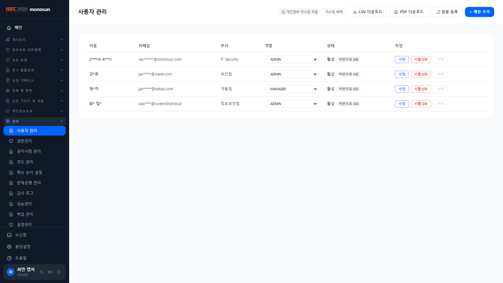

1. **관리 > 사용자 관리** 이동
2. **+ 사용자 추가** 버튼 클릭
3. 이름, 이메일, 부서, 초기 비밀번호, 역할 설정
   - 비밀번호 입력란 오른쪽 눈 아이콘을 클릭하면 입력한 내용을 확인할 수 있습니다
4. **저장**

> 비활성화된 계정은 로그인이 차단되나 데이터는 보존됩니다. 계정 삭제(완전 삭제)는 **비활성화된 계정에 한해** 활성화됩니다.

#### 계정 잠금 관리 (v1.7.0 신규)

- 각 계정의 상태 칸에 **비밀번호 오류 횟수**와 **잠김** 상태가 표시됩니다. 로그인 비밀번호를 반복 실패하면 계정이 일시 잠깁니다.
- 오류가 있거나 잠긴 계정에는 **잠금 해제** 버튼이 나타납니다. 클릭하면 비밀번호 오류 횟수를 0으로 초기화하고 잠금을 해제합니다(로그인 성공 시와 동일 처리).

---

### 19.2 역할 관리 (RBAC)

메뉴별 접근 권한을 설정합니다. **관리 > 권한관리** 메뉴이며 ADMIN 전용입니다.

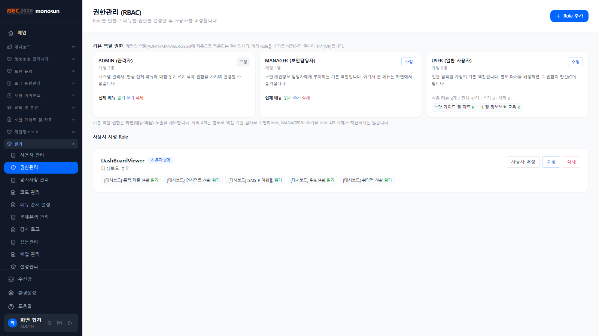

권한은 두 층으로 구성됩니다.

| 구분 | 적용 대상 | 설명 |
|------|-----------|------|
| **기본 역할 권한** | 계정의 역할(ADMIN·MANAGER·USER) | 역할을 가진 모든 계정에 자동 적용 |
| **사용자 지정 Role** | Role을 배정한 계정 | 기본 역할 권한에 **합산(OR)** |

최종 권한은 **기본 역할 권한 ∪ 배정된 Role 권한**입니다. 어느 한쪽에서 허용하면 허용됩니다.

#### 기본 역할 권한 (v1.18.0)

화면 상단의 **기본 역할 권한** 카드 3개에서 ADMIN·MANAGER·USER의 **현재 권한을 그대로 확인**하고, MANAGER·USER는 **수정**할 수 있습니다.

| 역할 | 초기 권한 | 수정 |
|------|-----------|------|
| **ADMIN** | 전체 메뉴 읽기·쓰기·삭제 | 불가 (항상 전체 권한) |
| **MANAGER** | 전체 메뉴 읽기·쓰기·삭제 | 가능 |
| **USER** | IT 및 정보보호 교육 · 보안 가이드 및 자료 읽기 | 가능 |

- 카드에는 **계정 수**, 허용 메뉴 수, 쓰기·삭제 허용 건수와 메뉴 목록(R·W·D 표시)이 나옵니다. 전 메뉴가 모두 허용된 상태면 "전체 메뉴 읽기·쓰기·삭제" 한 줄로 요약됩니다.
- **수정** 버튼을 누르면 메뉴별 권한 표가 열립니다. **전체 선택 / 전체 해제** 버튼으로 한 번에 지정할 수 있고, 쓰기·삭제를 켜면 읽기가 자동으로 포함됩니다.
- 저장하면 해당 역할을 가진 **모든 계정에 즉시 적용**됩니다(각 사용자는 다음 화면 이동 또는 재로그인 시 반영). 모든 권한을 해제하면 그 역할 계정에는 메뉴가 하나도 보이지 않으므로 저장 전 확인 창이 표시됩니다.
- 기본 역할 행은 사용자 지정 Role 목록에는 나타나지 않으며, 이름 변경·삭제·사용자 배정을 할 수 없습니다.
- **업그레이드로 메뉴가 새로 추가되면**, 기동 시 그 메뉴가 **MANAGER 기본 역할에 읽기·쓰기·삭제로 자동 보충**됩니다(MANAGER는 기본적으로 전 메뉴 사용이 전제이므로). 관리자가 의도적으로 끈 메뉴는 다시 켜지지 않고, **새로 생긴 메뉴만** 대상입니다. USER는 기본값이 최소 권한이라 보충하지 않습니다.

> **참고** 기본 역할 권한은 **화면(메뉴·버튼) 노출**을 제어합니다. 서버 API는 이와 별개로 역할 기반 검사(ADMIN/MANAGER)를 수행하므로, MANAGER의 쓰기를 해제해도 API 자체가 차단되지는 않습니다. 업무 분리를 강하게 적용하려면 계정의 역할 자체를 USER로 두고 필요한 Role만 배정하십시오.

#### 사용자 지정 Role

1. 우측 상단 **Role 추가** 클릭
2. Role 이름·설명 입력 후 메뉴별 **읽기·쓰기·삭제** 체크
3. 저장 후 **사용자 배정** 버튼으로 계정을 추가합니다. 한 사용자에게 여러 Role을 배정하면 권한이 합산됩니다.

---

### 19.3 공지사항

로그인 후 대시보드에 표시되는 공지사항을 관리합니다.

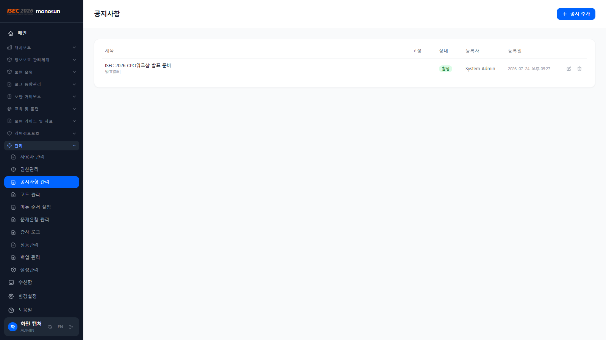

1. **관리 > 공지사항** 이동
2. **+ 공지 추가** 버튼 클릭
3. 제목, 내용 입력 — **상단 고정**·**활성화** 여부 선택
4. **저장**

- 고정된 공지는 목록 상단에 **고정** 배지와 함께 표시됩니다
- 비활성 공지는 사용자에게 노출되지 않습니다

---

### 19.4 코드 관리

드롭다운에서 사용되는 공통 코드 값 및 각종 기본 항목을 관리합니다.

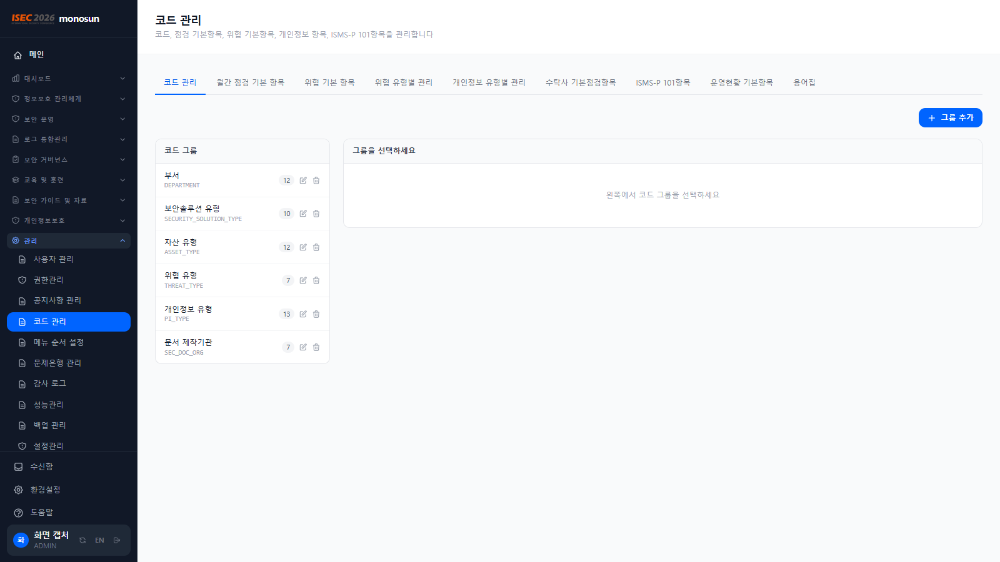

코드 관리 화면은 9개의 탭으로 구성됩니다.

| 탭 | 설명 |
|----|------|
| 코드 관리 | 부서·보안솔루션·자산·위협 유형 등 공통 코드 그룹 관리 |
| 월간 점검 기본 항목 | 정보보호의 날 월간 점검 항목 기본 목록 관리 |
| 위협 기본 항목 | 위험평가에서 사용할 기본 위협 항목 관리 |
| 위협 유형별 관리 | 위협 유형(THREAT_TYPE)별로 분류하여 항목 관리 |
| 개인정보 유형별 관리 | 개인정보 분류 유형별 항목 관리 |
| 수탁사 기본점검항목 | 수탁사 점검 시 사용할 기본 점검항목 템플릿 관리 |
| ISMS-P 101항목 | 인증항목별 기본 증적제목·증적내용·이행가이드 관리 |
| 운영현황 기본항목 | 운영현황관리의 점검 기준·점검항목 기본 목록 관리 (아래 참조) |
| 용어집 | 보안용어집에 표시되는 보안 용어 관리 (아래 참조) |

#### 운영현황 기본항목

**보안 운영 > 운영현황관리**에서 쓰는 점검 항목의 원본입니다. 최초 기동 시 표준 항목(정보보호 관리체계 45개 / 개인정보보호 관리체계 10개)이 자동 등록되며, 이후 조직에 맞게 관리합니다.

- 탭 안에서 **정보보호 관리체계 / 개인정보보호 관리체계**를 전환합니다. 각각 별도 목록입니다.
- 항목마다 구분 · 점검 기준(점검항목) · 주기 및 시점 · 보안적용 실적(상세 내용) · 책임자 · 실무자 · **월별 기본 계획** · 정렬 순서 · 사용 여부를 관리합니다.
- **월별 기본 계획**은 연도별 운영현황에 불러올 때 적용되는 초기 계획입니다. 상시·수시 항목은 모두 해제해 둡니다.
- 이 목록은 운영현황관리의 두 곳에서 쓰입니다.
  1. **기본 항목 불러오기** — **사용 중(active)** 인 항목만 해당 연도로 복제됩니다.
  2. **항목 추가** — 점검 기준을 이 목록에서 선택하며, 선택하면 주기·산출물·담당자·월별 계획이 함께 채워집니다.

> **삭제보다 미사용을 권장합니다.** 특정 구분의 기본 항목을 **모두 삭제하면 다음 기동 시 표준 항목이 다시 생성**됩니다(신규 설치·DB 재생성 대비 자동 복구). 쓰지 않는 항목은 **사용** 체크를 해제해 두면 목록과 불러오기에서 제외됩니다.

> 조회는 MANAGER 이상(운영현황 화면의 선택 목록으로 쓰기 때문), **등록·수정·삭제는 ADMIN 전용**입니다.

#### 용어집

**보안 가이드 및 자료 > 보안용어집** 화면에 표시되는 보안 용어를 관리합니다. 최초 기동 시 표준 용어 **178개**가 자동 등록됩니다.

- 용어별로 **한글 용어 · 영문 표기 · 약어 · 분류 · 의미 · 관련 키워드 · 정렬 순서 · 사용 여부**를 등록·수정·삭제합니다.
- **관련 키워드**는 쉼표로 구분해 입력하며, 용어집 화면에서 태그로 표시되고 클릭하면 그 값으로 검색됩니다.
- 용어·영문·약어·정의·키워드 통합 검색과 분류 필터, 20건 페이지네이션을 제공합니다.
- **한글 용어는 중복 등록할 수 없습니다**(대소문자 무시).

##### 엑셀 일괄등록

용어가 많을 때는 **엑셀 일괄등록** 버튼으로 한 번에 등록합니다.

1. **용어집 템플릿 다운로드 (.xlsx)** 를 눌러 서식을 받습니다. 헤더와 예시 2행이 채워져 있습니다.

   | 열 | 내용 | 비고 |
   |----|------|------|
   | 한글 용어* | 다중요소인증 | **필수** — 중복 판단 기준 |
   | 영문 표기 | Multi-Factor Authentication | |
   | 약어 | MFA | |
   | 분류 | 접근통제 | |
   | 의미 | 서로 다른 인증 요소를 두 개 이상 사용해 신원을 확인하는 방식 | |
   | 관련 키워드 | OTP, 생체인증 | 쉼표로 구분 |
   | 정렬 순서 | 1 | 비우면 자동 부여 |
   | 사용여부(Y/N) | Y | 비우면 사용 |

2. 파일을 작성해 업로드합니다.
3. **이미 등록된 용어의 내용을 덮어쓰기** 옵션을 선택할 수 있습니다.
   - **해제(기본)** — 이미 있는 용어는 건너뜁니다. 새 용어만 추가할 때 씁니다.
   - **선택** — 이미 있는 용어의 내용을 갱신합니다. **빈 칸은 기존 값을 지우지 않습니다**(채운 칸만 반영).
4. 결과에 **전체 · 등록 · 갱신 · 중복 제외 · 실패** 건수와 실패한 행의 사유가 표시됩니다.

> 한글 용어가 비어 있는 행은 실패로 처리되고, 파일 안에서 같은 용어가 반복되면 **첫 행만** 반영됩니다.

> 여기서도 **삭제보다 미사용을 권장합니다.** 용어를 **모두 삭제하면 다음 기동 시 기본 용어가 다시 생성**됩니다. 쓰지 않는 용어는 **사용** 체크를 해제하면 용어집 화면에서 제외됩니다.

> 조회는 로그인 사용자, **등록·수정·삭제는 ADMIN 전용**입니다.

#### 코드 그룹 및 코드값 관리

1. 왼쪽 **코드 그룹** 패널에서 그룹을 클릭합니다.
2. 오른쪽에 해당 그룹의 코드값 테이블이 표시됩니다.
   - **표시명**: 화면에 표시되는 이름
   - **값**: 시스템 내부 코드값
   - **설명**: 코드값에 대한 부가 설명
   - **정렬**: 드롭다운에서 표시되는 순서
   - **상태**: 사용/미사용
3. **+ 코드값 추가** 버튼으로 새 항목을 추가합니다.
4. 행의 **수정** 버튼으로 기존 항목을 수정합니다.

#### 개인정보 유형별 관리 탭

개인정보 분류 기준에 따른 항목을 유형별로 관리합니다.

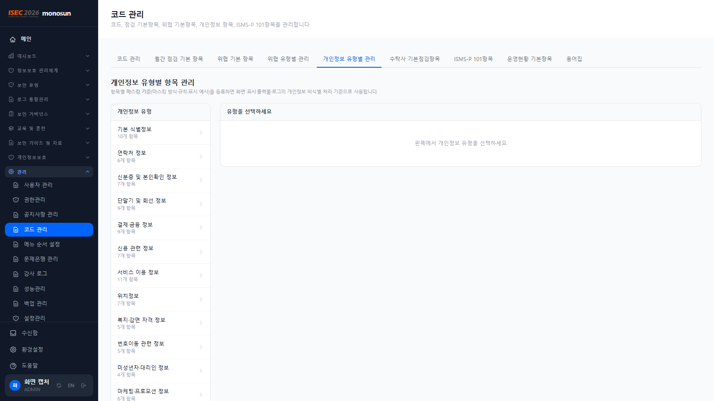

- 왼쪽 패널: 개인정보 유형 목록 (기본 식별정보, 연락처 정보, 결제·금융 정보 등 13개 유형)
- 오른쪽 패널: 선택한 유형에 속하는 개인정보 항목 목록 (항목명·설명·상태 표시)
- **+ 항목 추가** 버튼으로 해당 유형에 새 개인정보 항목을 추가할 수 있습니다.

#### 수탁사 기본점검항목 탭 (v1.52.0 신규)

수탁사 점검항목의 템플릿이 되는 기본 항목을 관리합니다. 이 탭에서 관리하는 항목은 **수탁사 점검항목 관리**에서 "기본 점검항목 추가" 또는 "초기화" 시의 기준 데이터로 사용됩니다.

| 컬럼 | 설명 |
|------|------|
| 카테고리 | 항목 분류 (예: 개인정보 보호, 기술적 보호 등) |
| 항목명 | 점검항목 이름 |
| 점검 방법 | 점검 수행 방법 기술 |
| 점검 기준 | 합격/불합격 판단 기준 |
| 정렬 | 표시 순서 |

- **+ 기본 점검항목 추가** 버튼으로 새 기본 항목을 추가합니다.
- 기존 항목은 수정·삭제 가능합니다.

> 기본점검항목은 실제 점검 결과와는 독립적인 **템플릿** 데이터입니다. 이 목록을 변경해도 이미 생성된 점검 결과에는 영향을 주지 않습니다.

---

### 19.5 문제은행 관리

교육 퀴즈에서 재사용할 수 있는 문항 풀(문제은행)을 관리합니다.

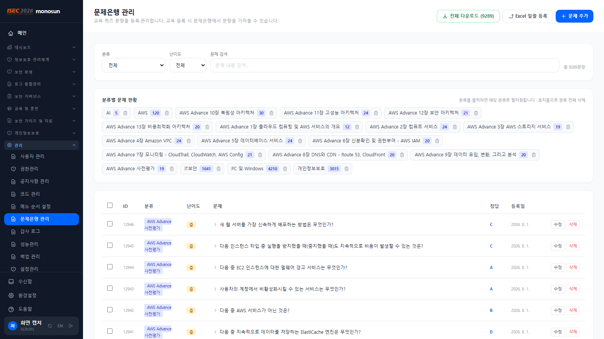

1. **관리 > 문제은행** 이동
2. **+ 문제 추가** 버튼으로 개별 등록:
   - 분류(카테고리), 난이도(상/중/하), 문제, 보기 A~E, 정답, 해설
   - **보기는 A~E까지 입력할 수 있습니다** — 4지선다는 보기 E를 비워 두면 되고, 5지선다는 보기 E까지 채웁니다
   - **정답은 복수 선택이 가능합니다** — A~E 버튼을 눌러 정답을 여러 개 지정할 수 있습니다. 보기 C·D·E는 내용을 입력해야 정답으로 지정할 수 있습니다
3. **Excel 일괄 등록** 버튼으로 대량 등록:
   - 엑셀 템플릿 다운로드 → 문항 작성 → 업로드
   - 분류·문제·보기A/B·정답(A~E)은 필수 입력입니다. 보기C~E는 선택이며, 보기E까지 채우면 5지선다 문항이 됩니다
   - 보기E 열이 없는 예전 양식(9열) 파일도 그대로 업로드할 수 있습니다 — 헤더를 보고 자동으로 인식합니다
   - **복수 정답**은 정답 칸에 `A,B`처럼 콤마로 구분하거나 `AB`처럼 붙여 써도 됩니다 (`a b` · `A/B` 형태도 동일하게 인식)
   - **동일한 문제(문제 텍스트 일치)는 자동으로 제외**됩니다 — 이미 등록된 문항이나 파일 내 중복은 건너뛰고, 결과에 **중복 제외 N건**으로 표시됩니다
   - 업로드가 시작되면 **등록시작** 버튼이 비활성화되어 중복 등록을 방지합니다
4. 카테고리·난이도 필터로 문항을 조회하고 수정·삭제할 수 있습니다
5. **분류별 문제 현황**: 목록 상단에 분류별 문제 수가 표시됩니다
   - 분류를 클릭하면 해당 분류로 목록이 필터링됩니다
   - 분류 옆 **휴지통** 아이콘으로 해당 분류의 문제를 한 번에 일괄 삭제할 수 있습니다 (되돌릴 수 없음)
6. **문항 다운로드**: 등록된 문항을 Excel로 내려받을 수 있습니다 (일괄등록 양식과 동일한 형식이라 그대로 재업로드 가능)
   - **전체 다운로드** — 문제은행 전체 문항을 내려받습니다
   - 분류·난이도·검색어 필터를 적용한 상태에서는 **검색결과 다운로드**로 바뀌어 해당 조건의 문항만 내려받습니다
   - 체크박스로 문항을 고르면 **선택 문제 다운로드**로 고른 문항만 내려받습니다 (페이지를 이동해도 선택은 유지됩니다)

> 교육 과정 등록 화면에서 문제은행의 문항을 불러와 퀴즈를 구성할 수 있습니다.
>
> 복수 정답 문항은 응시 화면에서 **체크박스**로 표시되며 "복수 정답 문항입니다 — 정답을 모두 선택하세요" 안내가 함께 나옵니다. 채점은 **정답 보기를 모두 정확히 선택해야 정답**으로 인정합니다(하나라도 빠지거나 오답을 함께 고르면 오답).

---

### 19.6 감사 로그

시스템에서 발생한 사용자 행위(로그인, 등록·수정·삭제 등) 이력을 조회합니다.

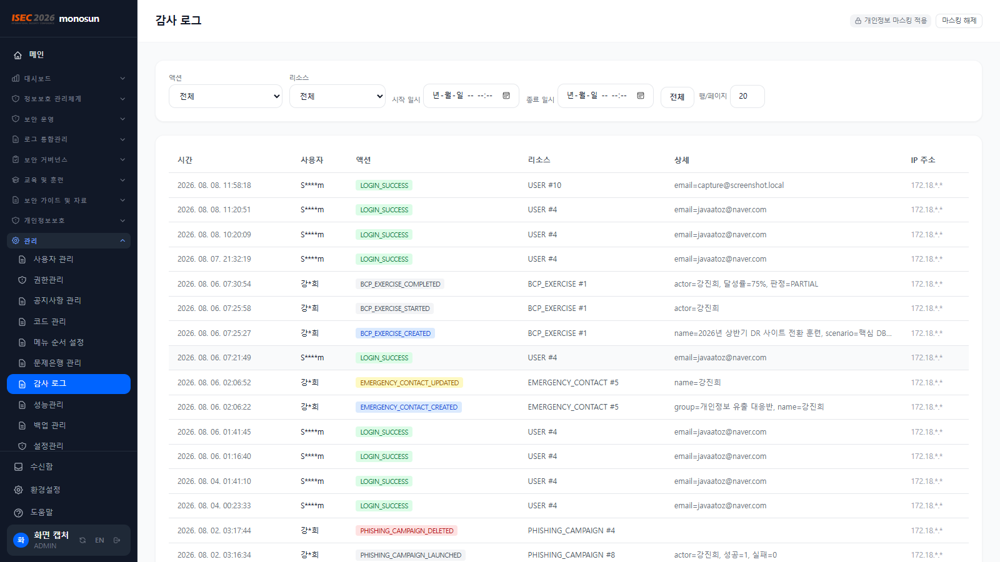

- **작업(Action)** 필터: 인증/사용자/정책/취약점/인시던트/자산 등 분류별 선택 또는 직접 입력
- **리소스** 필터: 대상 리소스 유형 선택 또는 직접 입력
- **기간** 필터: 시작일~종료일
- 행별로 사용자, 작업, 리소스, 상세 내용, 일시가 표시됩니다

---

### 19.7 백업 관리

시스템 환경 설정 및 DB 데이터를 백업하고 복원합니다.

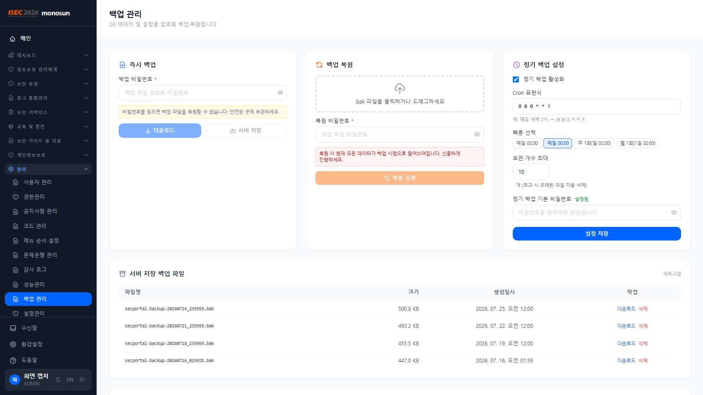

#### 즉시 백업 (다운로드)

1. **관리 > 백업 관리** 이동
2. **즉시 백업** 카드의 비밀번호 입력란에 암호화 비밀번호 입력
3. **백업 파일 다운로드** 버튼 클릭
4. `.bak` 확장자의 암호화된 백업 파일이 다운로드됩니다

> 비밀번호는 복원 시 반드시 필요합니다. **분실 시 복원 불가**이므로 안전하게 보관하세요.

#### 즉시 백업 (서버 저장)

1. 비밀번호 입력 후 **서버에 저장** 버튼 클릭
2. 서버의 `/app/backups` 디렉토리에 파일이 저장됩니다
3. 저장된 파일은 아래 **서버 백업 파일** 목록에서 확인·다운로드·삭제 가능

#### 백업 복원

> **주의**: 복원 시 현재 DB 데이터가 백업 파일의 데이터로 교체됩니다.

1. **백업 복원** 카드에서 `.bak` 파일을 드래그 앤 드롭하거나 **파일 선택** 버튼으로 업로드
2. 백업 시 사용한 비밀번호 입력
3. **복원 실행** 버튼 클릭
4. 경고 확인 모달에서 "복원 실행" 버튼을 다시 클릭하여 확인
5. 복원 완료 후 페이지를 새로고침합니다

#### 정기 백업 설정

1. **정기 백업 설정** 카드에서 **정기 백업 활성화** 토글을 켭니다
2. Cron 표현식을 직접 입력하거나 **빠른 선택** 버튼 사용:
   - 매일 02:00: `0 0 2 * * ?`
   - 매일 00:00: `0 0 0 * * ?`
   - 주 1회 (일 02:00): `0 0 2 ? * SUN`
   - 월 1회 (1일 02:00): `0 0 2 1 * ?`
3. **기본 비밀번호** 설정 (정기 백업 시 이 비밀번호로 암호화)
4. **최대 보관 개수** 설정 (초과 시 오래된 파일부터 자동 삭제)
5. **설정 저장** 버튼 클릭

> Cron 표현식 형식: `초 분 시 일 월 요일`  
> 예: `0 0 2 * * ?` = 매일 새벽 2시 0분 0초

#### 서버 백업 파일 목록

- 서버에 저장된 백업 파일 목록 표시
- **다운로드** 아이콘: 해당 파일을 로컬에 다운로드
- **삭제** 아이콘: 해당 파일을 서버에서 삭제

#### 백업 이력

| 컬럼 | 설명 |
|------|------|
| 유형 | MANUAL(즉시)/SCHEDULED(정기)/RESTORE(복원) |
| 파일명 | 생성된 파일명 |
| 크기 | 파일 크기 (KB/MB) |
| 상태 | SUCCESS / FAILURE / IN_PROGRESS |
| 메시지 | 성공 메시지 또는 오류 내용 |
| 일시 | 실행 일시 |

---

### 19.8 설정관리

시스템 전반 설정을 탭으로 구분하여 관리합니다.

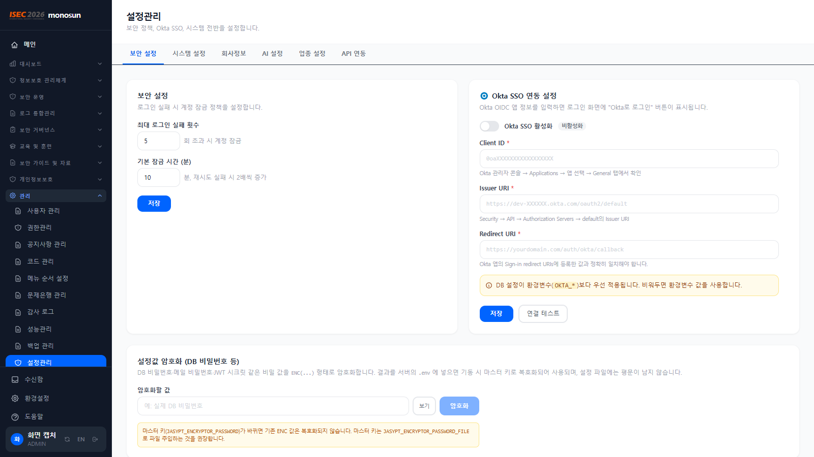

| 탭 | 설명 |
|----|------|
| 보안 설정 | 세션 타임아웃, 비밀번호 정책, 로그인 실패 잠금 등 |
| 시스템 설정 | 로그인 페이지 로고(**브라우저 탭 아이콘/파비콘에도 자동 적용**, v1.11.1), 이메일 알림 발송, RSS 보안공지 피드, **발송 메일서버(SMTP) 설정** |
| 회사정보 | 회사명·로고 등 회사 기본 정보 |
| AI 설정 | 로그 AI 분석에 사용할 AI API 키 등록 |
| 업종 설정 | 법령준수관리의 "우리 업종만" 필터에 사용할 회사 업종 지정, 업종 내 개별 법령 선택, **목록에 없는 법령·고시 검색 추가** (v1.15.0), **법령 개정정보 조회 기간** (v1.9.0) |
| API 연동 | 법제처 Open API 키, GitHub 연동(Personal Access Token) 등록 |

#### 메뉴 관리 (v1.11.0)

**관리 > 메뉴 관리**에서 좌측 메뉴 구성을 직접 편집합니다.

- **상위 메뉴 추가·삭제·이름 변경** — 사용자 정의 상위 그룹을 만들거나 기본 그룹 이름도 바꿀 수 있습니다.
- **하위 메뉴 이동** — 각 하위 메뉴의 "상위 메뉴" 드롭다운으로 다른 상위 메뉴로 옮기고, 화살표/드래그로 순서를 바꿉니다.
- 하위 메뉴가 있는 상위 메뉴는 삭제 전 하위 메뉴를 먼저 이동해야 합니다(메뉴 유실 방지).
- 저장하면 좌측 사이드바에 즉시 반영됩니다. 접근 권한(RBAC)은 그대로 유지됩니다.

#### 법령 개정정보 조회 기간 (v1.9.0)

대시보드 **법령 개정** 위젯이 표시할 기간을 지정합니다. **설정관리 > 업종 설정** 탭에서 프리셋(**1주일 · 1개월 · 3개월 · 6개월 · 12개월**) 또는 1~365일을 직접 입력합니다(기본값 30일). 선택한 업종의 관련 법령 중 이 기간 내에 공포된 법령만 위젯에 표시됩니다. 법제처 API 키(OC 코드)가 필요하며, 미설정 시 **API 연동 탭**으로 안내하는 경고가 표시됩니다.

#### 발송 메일서버(SMTP) 설정 (v1.8.0, ADMIN 전용)

승인 알림·모의훈련 메일 발송에 사용할 SMTP 서버를 **화면에서 직접 설정**합니다. 서버 재시작이나 설정 파일 수정이 필요 없습니다.

1. **관리 > 설정관리 > 시스템 설정** 탭 이동
2. **발송 메일서버(SMTP) 설정** 영역에서 아래 항목 입력:
   - SMTP 호스트 (예: `smtp.gmail.com`), 포트 (예: 587)
   - 계정(사용자명), 비밀번호
   - 발신자 주소(From), 발신자 표시 이름
   - SMTP 인증 사용 / STARTTLS 사용 여부
3. **테스트 수신 이메일**을 입력하고 **테스트 메일 발송**으로 설정을 검증
4. 상단 스위치로 **활성화**한 뒤 저장

| 상태 | 발송 동작 |
|------|-----------|
| 활성화 | 이 화면의 SMTP 설정으로 메일을 발송합니다 |
| 비활성 / 미설정 | 서버 설정 파일(`application.yml`의 `spring.mail.*`)의 기본 설정으로 발송합니다 |

> **보안 주의**: 비밀번호는 화면 조회 시 마스킹되지만 **DB에는 평문으로 저장**됩니다. 운영 환경에서는 개인 계정이 아닌 **발송 전용 계정**(앱 비밀번호 등)을 사용하세요.

---

## 20. 환경설정 (내 설정)

사이드바 하단의 **환경설정** 메뉴에서 개인 화면 설정과 계정을 관리합니다.
**화면 / 계정 / 정보** 세 개의 탭으로 구성됩니다.

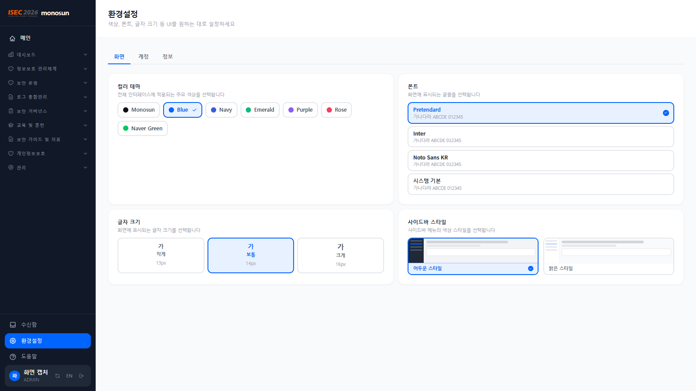

### 화면 탭

색상, 폰트, 글자 크기 등 UI를 원하는 대로 설정합니다. (브라우저별 저장)

- **컬러 테마**: Monosun / Blue / Navy / Emerald / Purple / Rose / Naver Green 중 선택
- **폰트**: 화면에 표시될 글꼴 선택
- **글자 크기**: 화면 전체 글자 크기 조절
- **사이드바 스타일**: 어두운 스타일 / 밝은 스타일 선택

### 계정 탭

#### 비밀번호 변경

1. 현재 비밀번호, 새 비밀번호, 비밀번호 확인 입력
2. **변경** 버튼 클릭

#### MFA (다중 인증) 설정

1. **MFA 활성화** 버튼 클릭
2. 화면에 표시된 QR 코드를 Google Authenticator 등의 OTP 앱으로 스캔
3. OTP 앱에서 생성된 6자리 코드 입력하여 등록 완료

#### 수신함 비우기

수신함의 모든 메시지를 영구 삭제합니다. 실행 전 확인 모달이 표시됩니다.

### 정보 탭

시스템 버전, 주요 기능 요약, 기술 스택, 역할(Role) 안내를 확인합니다.

---

## 21. 도움말

사이드바 하단 **환경설정** 아래의 **도움말** 메뉴에서 이 사용자 매뉴얼을 웹페이지 형태로 열람합니다.

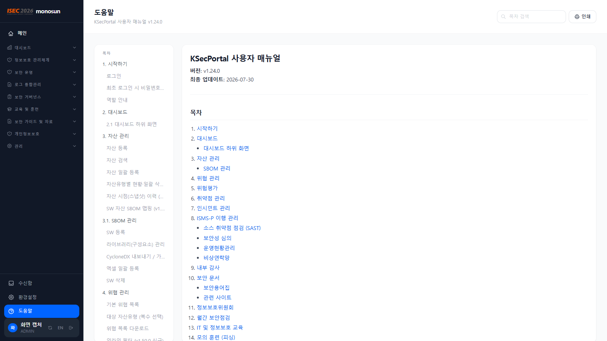

- **목차 패널**: 왼쪽 목차에서 원하는 섹션을 클릭하면 해당 위치로 이동합니다. 현재 읽고 있는 섹션이 하이라이트됩니다.
- **목차 검색**: 우상단 검색란에 키워드를 입력하면 목차가 필터링됩니다.
- **스크린샷 확대**: 본문의 화면 캡처 이미지를 클릭하면 크게 볼 수 있습니다.
- **인쇄**: 우상단 **인쇄** 버튼으로 매뉴얼 전체를 인쇄하거나 PDF로 저장할 수 있습니다.

---

## 부록: 위험점수 계산표

위험점수 = 가능성(1~5) × 영향도(1~5)

| | 영향도 1 | 영향도 2 | 영향도 3 | 영향도 4 | 영향도 5 |
|---|---|---|---|---|---|
| **가능성 1** | 1 | 2 | 3 | 4 | 5 |
| **가능성 2** | 2 | 4 | 6 | 8 | 10 |
| **가능성 3** | 3 | 6 | 9 | 12 | 15 |
| **가능성 4** | 4 | 8 | 12 | 16 | 20 |
| **가능성 5** | 5 | 10 | 15 | 20 | 25 |

- **고위험** (빨강): 15점 이상
- **중위험** (노랑): 8~14점
- **저위험** (초록): 7점 이하

---

## 부록 A. 데이터베이스 ERD

전체 테이블을 기능 도메인별로 나누어 표현합니다. PK/FK 중심으로 핵심 컬럼만 표시합니다.

---

### A.1 사용자 & 인증

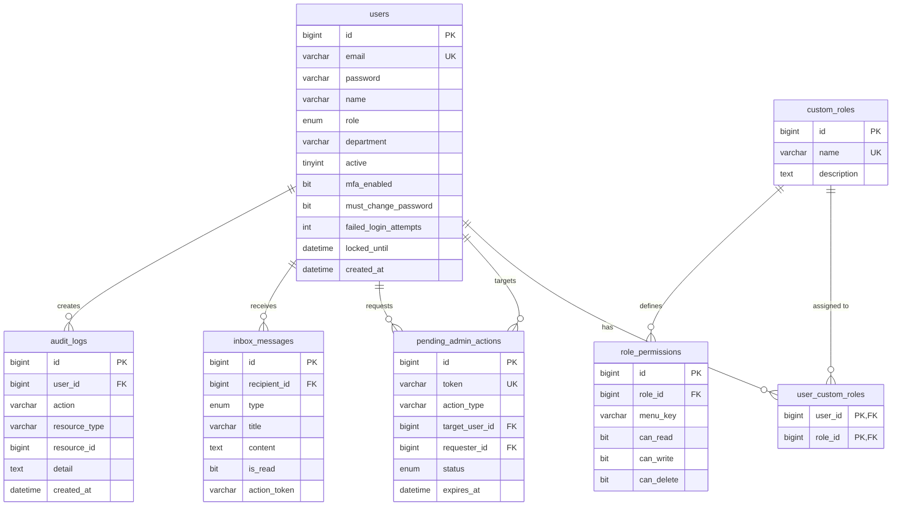
```mermaid
erDiagram
    users {
        bigint id PK
        varchar email UK
        varchar password
        varchar name
        enum role
        varchar department
        tinyint active
        bit mfa_enabled
        bit must_change_password
        int failed_login_attempts
        datetime locked_until
        datetime created_at
    }
    custom_roles {
        bigint id PK
        varchar name UK
        text description
    }
    user_custom_roles {
        bigint user_id PK,FK
        bigint role_id PK,FK
    }
    role_permissions {
        bigint id PK
        bigint role_id FK
        varchar menu_key
        bit can_read
        bit can_write
        bit can_delete
    }
    pending_admin_actions {
        bigint id PK
        varchar token UK
        varchar action_type
        bigint target_user_id FK
        bigint requester_id FK
        enum status
        datetime expires_at
    }
    inbox_messages {
        bigint id PK
        bigint recipient_id FK
        enum type
        varchar title
        text content
        bit is_read
        varchar action_token
    }
    audit_logs {
        bigint id PK
        bigint user_id FK
        varchar action
        varchar resource_type
        bigint resource_id
        text detail
        datetime created_at
    }

    users ||--o{ user_custom_roles : "has"
    custom_roles ||--o{ user_custom_roles : "assigned to"
    custom_roles ||--o{ role_permissions : "defines"
    users ||--o{ pending_admin_actions : "targets"
    users ||--o{ pending_admin_actions : "requests"
    users ||--o{ inbox_messages : "receives"
    users ||--o{ audit_logs : "creates"
```

---

### A.2 자산 & 위험 평가

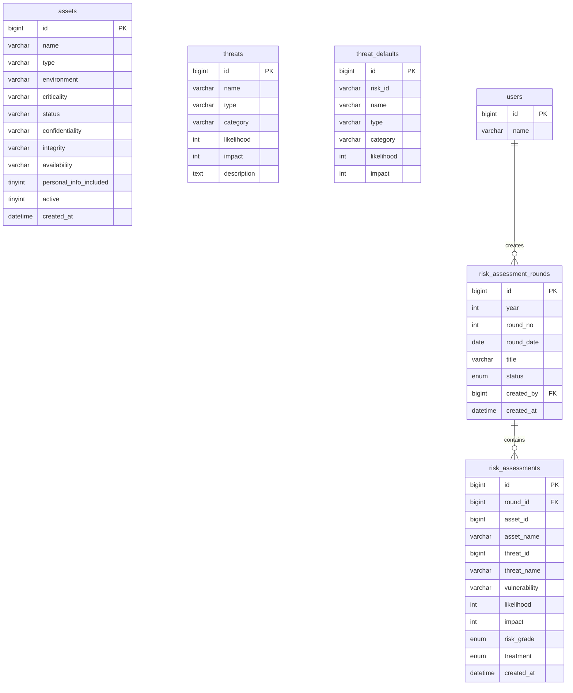
```mermaid
erDiagram
    assets {
        bigint id PK
        varchar name
        varchar type
        varchar environment
        varchar criticality
        varchar status
        varchar confidentiality
        varchar integrity
        varchar availability
        tinyint personal_info_included
        tinyint active
        datetime created_at
    }
    risk_assessment_rounds {
        bigint id PK
        int year
        int round_no
        date round_date
        varchar title
        enum status
        bigint created_by FK
        datetime created_at
    }
    risk_assessments {
        bigint id PK
        bigint round_id FK
        bigint asset_id
        varchar asset_name
        bigint threat_id
        varchar threat_name
        varchar vulnerability
        int likelihood
        int impact
        enum risk_grade
        enum treatment
        datetime created_at
    }
    threats {
        bigint id PK
        varchar name
        varchar type
        varchar category
        int likelihood
        int impact
        text description
    }
    threat_defaults {
        bigint id PK
        varchar risk_id
        varchar name
        varchar type
        varchar category
        int likelihood
        int impact
    }
    users {
        bigint id PK
        varchar name
    }

    users ||--o{ risk_assessment_rounds : "creates"
    risk_assessment_rounds ||--o{ risk_assessments : "contains"
```

---

### A.3 취약점 & 인시던트

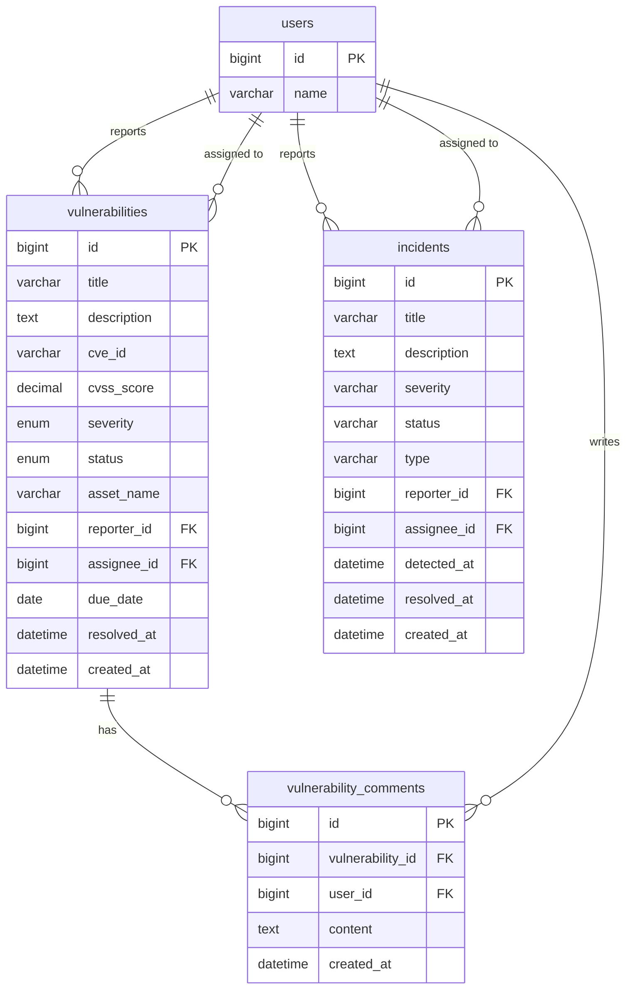
```mermaid
erDiagram
    vulnerabilities {
        bigint id PK
        varchar title
        text description
        varchar cve_id
        decimal cvss_score
        enum severity
        enum status
        varchar asset_name
        bigint reporter_id FK
        bigint assignee_id FK
        date due_date
        datetime resolved_at
        datetime created_at
    }
    vulnerability_comments {
        bigint id PK
        bigint vulnerability_id FK
        bigint user_id FK
        text content
        datetime created_at
    }
    incidents {
        bigint id PK
        varchar title
        text description
        varchar severity
        varchar status
        varchar type
        bigint reporter_id FK
        bigint assignee_id FK
        datetime detected_at
        datetime resolved_at
        datetime created_at
    }
    users {
        bigint id PK
        varchar name
    }

    users ||--o{ vulnerabilities : "reports"
    users ||--o{ vulnerabilities : "assigned to"
    vulnerabilities ||--o{ vulnerability_comments : "has"
    users ||--o{ vulnerability_comments : "writes"
    users ||--o{ incidents : "reports"
    users ||--o{ incidents : "assigned to"
```

---

### A.4 정책 & ISMS-P 증적

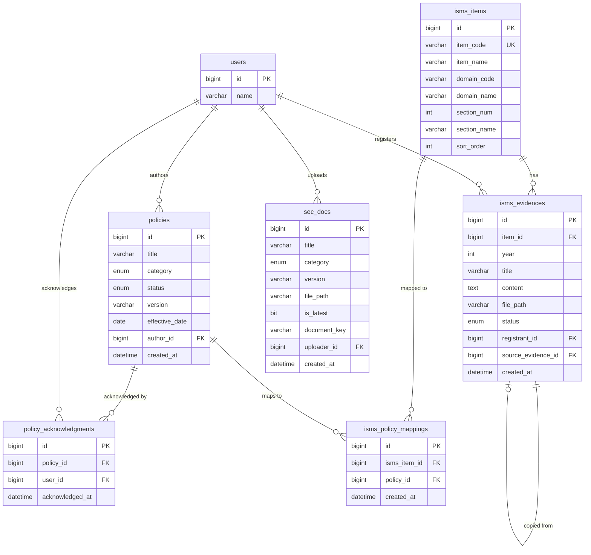
```mermaid
erDiagram
    policies {
        bigint id PK
        varchar title
        enum category
        enum status
        varchar version
        date effective_date
        bigint author_id FK
        datetime created_at
    }
    policy_acknowledgments {
        bigint id PK
        bigint policy_id FK
        bigint user_id FK
        datetime acknowledged_at
    }
    isms_items {
        bigint id PK
        varchar item_code UK
        varchar item_name
        varchar domain_code
        varchar domain_name
        int section_num
        varchar section_name
        int sort_order
    }
    isms_evidences {
        bigint id PK
        bigint item_id FK
        int year
        varchar title
        text content
        varchar file_path
        enum status
        bigint registrant_id FK
        bigint source_evidence_id FK
        datetime created_at
    }
    isms_policy_mappings {
        bigint id PK
        bigint isms_item_id FK
        bigint policy_id FK
        datetime created_at
    }
    sec_docs {
        bigint id PK
        varchar title
        enum category
        varchar version
        varchar file_path
        bit is_latest
        varchar document_key
        bigint uploader_id FK
        datetime created_at
    }
    users {
        bigint id PK
        varchar name
    }

    users ||--o{ policies : "authors"
    policies ||--o{ policy_acknowledgments : "acknowledged by"
    users ||--o{ policy_acknowledgments : "acknowledges"
    isms_items ||--o{ isms_evidences : "has"
    users ||--o{ isms_evidences : "registers"
    isms_evidences ||--o| isms_evidences : "copied from"
    isms_items ||--o{ isms_policy_mappings : "mapped to"
    policies ||--o{ isms_policy_mappings : "maps to"
    users ||--o{ sec_docs : "uploads"
```

---

### A.5 내부 감사 & 보안 조치

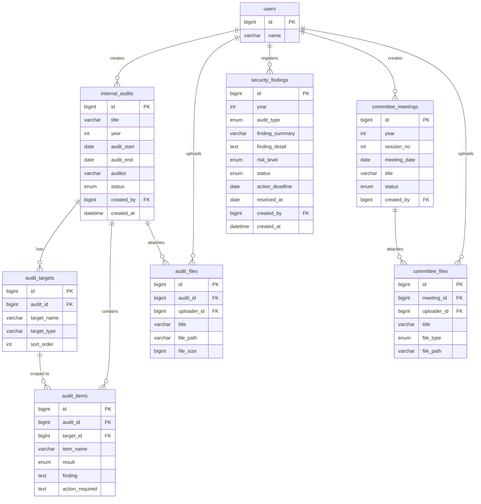
```mermaid
erDiagram
    internal_audits {
        bigint id PK
        varchar title
        int year
        date audit_start
        date audit_end
        varchar auditor
        enum status
        bigint created_by FK
        datetime created_at
    }
    audit_targets {
        bigint id PK
        bigint audit_id FK
        varchar target_name
        varchar target_type
        int sort_order
    }
    audit_items {
        bigint id PK
        bigint audit_id FK
        bigint target_id FK
        varchar item_name
        enum result
        text finding
        text action_required
    }
    audit_files {
        bigint id PK
        bigint audit_id FK
        bigint uploader_id FK
        varchar title
        varchar file_path
        bigint file_size
    }
    security_findings {
        bigint id PK
        int year
        enum audit_type
        varchar finding_summary
        text finding_detail
        enum risk_level
        enum status
        date action_deadline
        date resolved_at
        bigint created_by FK
        datetime created_at
    }
    committee_meetings {
        bigint id PK
        int year
        int session_no
        date meeting_date
        varchar title
        enum status
        bigint created_by FK
    }
    committee_files {
        bigint id PK
        bigint meeting_id FK
        bigint uploader_id FK
        varchar title
        enum file_type
        varchar file_path
    }
    users {
        bigint id PK
        varchar name
    }

    users ||--o{ internal_audits : "creates"
    internal_audits ||--o{ audit_targets : "has"
    internal_audits ||--o{ audit_items : "contains"
    audit_targets ||--o{ audit_items : "scoped to"
    internal_audits ||--o{ audit_files : "attaches"
    users ||--o{ audit_files : "uploads"
    users ||--o{ security_findings : "registers"
    users ||--o{ committee_meetings : "creates"
    committee_meetings ||--o{ committee_files : "attaches"
    users ||--o{ committee_files : "uploads"
```

---

### A.6 IT 및 정보보호 교육 & 피싱 훈련

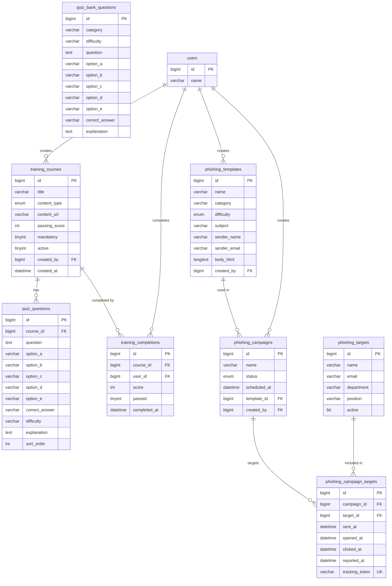
```mermaid
erDiagram
    training_courses {
        bigint id PK
        varchar title
        enum content_type
        varchar content_url
        int passing_score
        tinyint mandatory
        tinyint active
        bigint created_by FK
        datetime created_at
    }
    quiz_questions {
        bigint id PK
        bigint course_id FK
        text question
        varchar option_a
        varchar option_b
        varchar option_c
        varchar option_d
        varchar option_e
        varchar correct_answer
        varchar difficulty
        text explanation
        int sort_order
    }
    quiz_bank_questions {
        bigint id PK
        varchar category
        varchar difficulty
        text question
        varchar option_a
        varchar option_b
        varchar option_c
        varchar option_d
        varchar option_e
        varchar correct_answer
        text explanation
    }
    training_completions {
        bigint id PK
        bigint course_id FK
        bigint user_id FK
        int score
        tinyint passed
        datetime completed_at
    }
    phishing_templates {
        bigint id PK
        varchar name
        varchar category
        enum difficulty
        varchar subject
        varchar sender_name
        varchar sender_email
        longtext body_html
        bigint created_by FK
    }
    phishing_campaigns {
        bigint id PK
        varchar name
        enum status
        datetime scheduled_at
        bigint template_id FK
        bigint created_by FK
    }
    phishing_targets {
        bigint id PK
        varchar name
        varchar email
        varchar department
        varchar position
        bit active
    }
    phishing_campaign_targets {
        bigint id PK
        bigint campaign_id FK
        bigint target_id FK
        datetime sent_at
        datetime opened_at
        datetime clicked_at
        datetime reported_at
        varchar tracking_token UK
    }
    users {
        bigint id PK
        varchar name
    }

    users ||--o{ training_courses : "creates"
    training_courses ||--o{ quiz_questions : "has"
    training_courses ||--o{ training_completions : "completed by"
    users ||--o{ training_completions : "completes"
    users ||--o{ phishing_templates : "creates"
    phishing_templates ||--o{ phishing_campaigns : "used in"
    users ||--o{ phishing_campaigns : "creates"
    phishing_campaigns ||--o{ phishing_campaign_targets : "targets"
    phishing_targets ||--o{ phishing_campaign_targets : "included in"
```

---

### A.7 월간 보안 점검

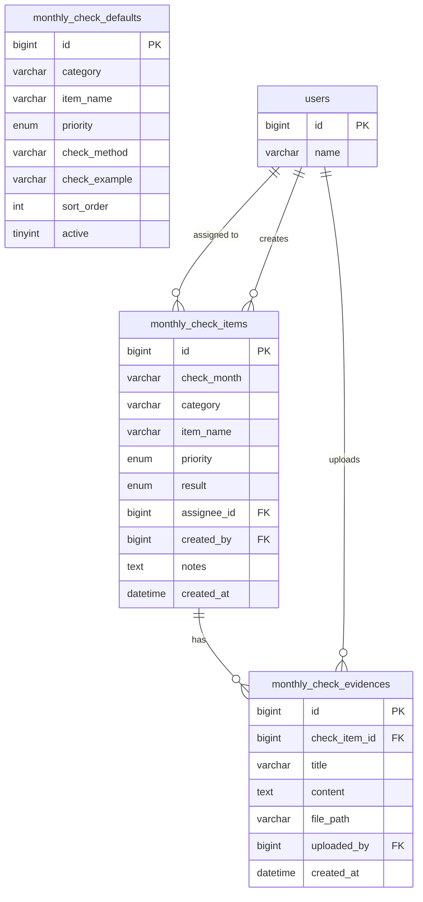
```mermaid
erDiagram
    monthly_check_defaults {
        bigint id PK
        varchar category
        varchar item_name
        enum priority
        varchar check_method
        varchar check_example
        int sort_order
        tinyint active
    }
    monthly_check_items {
        bigint id PK
        varchar check_month
        varchar category
        varchar item_name
        enum priority
        enum result
        bigint assignee_id FK
        bigint created_by FK
        text notes
        datetime created_at
    }
    monthly_check_evidences {
        bigint id PK
        bigint check_item_id FK
        varchar title
        text content
        varchar file_path
        bigint uploaded_by FK
        datetime created_at
    }
    users {
        bigint id PK
        varchar name
    }

    users ||--o{ monthly_check_items : "assigned to"
    users ||--o{ monthly_check_items : "creates"
    monthly_check_items ||--o{ monthly_check_evidences : "has"
    users ||--o{ monthly_check_evidences : "uploads"
```

---

### A.8 개인정보보호 — 수탁사

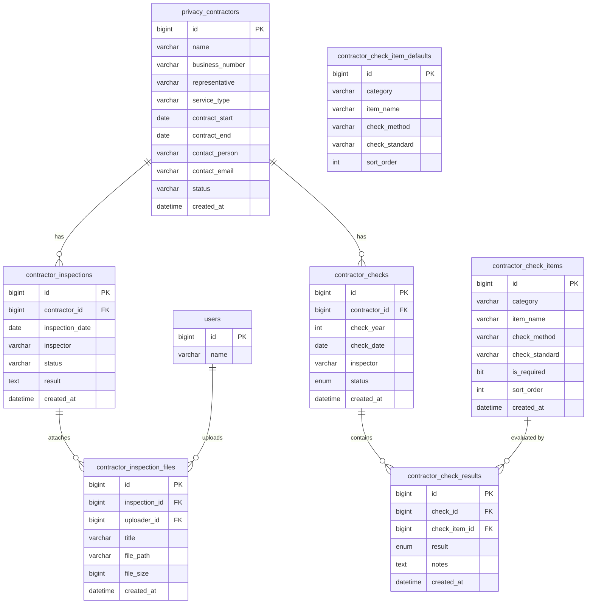
```mermaid
erDiagram
    privacy_contractors {
        bigint id PK
        varchar name
        varchar business_number
        varchar representative
        varchar service_type
        date contract_start
        date contract_end
        varchar contact_person
        varchar contact_email
        varchar status
        datetime created_at
    }
    contractor_inspections {
        bigint id PK
        bigint contractor_id FK
        date inspection_date
        varchar inspector
        varchar status
        text result
        datetime created_at
    }
    contractor_inspection_files {
        bigint id PK
        bigint inspection_id FK
        bigint uploader_id FK
        varchar title
        varchar file_path
        bigint file_size
        datetime created_at
    }
    contractor_check_item_defaults {
        bigint id PK
        varchar category
        varchar item_name
        varchar check_method
        varchar check_standard
        int sort_order
    }
    contractor_check_items {
        bigint id PK
        varchar category
        varchar item_name
        varchar check_method
        varchar check_standard
        bit is_required
        int sort_order
        datetime created_at
    }
    contractor_checks {
        bigint id PK
        bigint contractor_id FK
        int check_year
        date check_date
        varchar inspector
        enum status
        datetime created_at
    }
    contractor_check_results {
        bigint id PK
        bigint check_id FK
        bigint check_item_id FK
        enum result
        text notes
        datetime created_at
    }
    users {
        bigint id PK
        varchar name
    }

    privacy_contractors ||--o{ contractor_inspections : "has"
    contractor_inspections ||--o{ contractor_inspection_files : "attaches"
    users ||--o{ contractor_inspection_files : "uploads"
    privacy_contractors ||--o{ contractor_checks : "has"
    contractor_checks ||--o{ contractor_check_results : "contains"
    contractor_check_items ||--o{ contractor_check_results : "evaluated by"
```

---

### A.9 보안 통합 & 이벤트

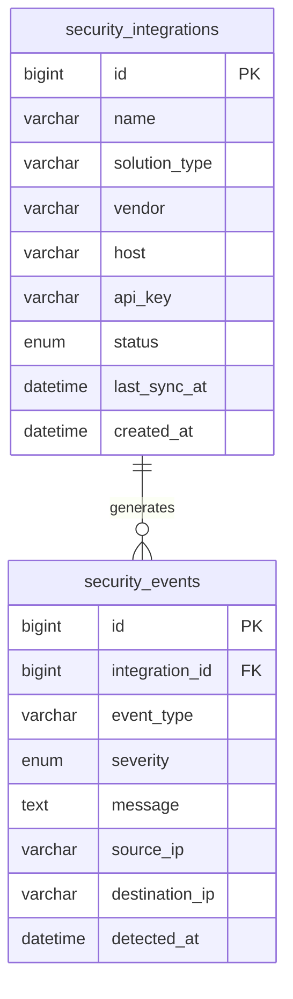
```mermaid
erDiagram
    security_integrations {
        bigint id PK
        varchar name
        varchar solution_type
        varchar vendor
        varchar host
        varchar api_key
        enum status
        datetime last_sync_at
        datetime created_at
    }
    security_events {
        bigint id PK
        bigint integration_id FK
        varchar event_type
        enum severity
        text message
        varchar source_ip
        varchar destination_ip
        datetime detected_at
    }

    security_integrations ||--o{ security_events : "generates"
```

---

### A.10 코드 & 시스템 설정

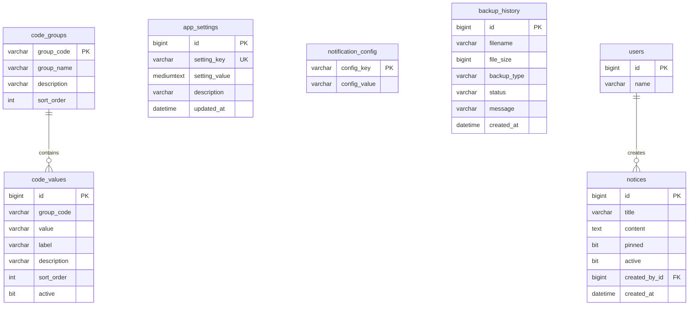
```mermaid
erDiagram
    code_groups {
        varchar group_code PK
        varchar group_name
        varchar description
        int sort_order
    }
    code_values {
        bigint id PK
        varchar group_code
        varchar value
        varchar label
        varchar description
        int sort_order
        bit active
    }
    app_settings {
        bigint id PK
        varchar setting_key UK
        mediumtext setting_value
        varchar description
        datetime updated_at
    }
    notification_config {
        varchar config_key PK
        varchar config_value
    }
    notices {
        bigint id PK
        varchar title
        text content
        bit pinned
        bit active
        bigint created_by_id FK
        datetime created_at
    }
    backup_history {
        bigint id PK
        varchar filename
        bigint file_size
        varchar backup_type
        varchar status
        varchar message
        datetime created_at
    }
    users {
        bigint id PK
        varchar name
    }

    code_groups ||--o{ code_values : "contains"
    users ||--o{ notices : "creates"
```

---

## 변경 이력

| 버전 | 날짜 | 주요 변경 내용 |
|------|------|----------------|
| v1.25.0 | 2026-08-01 | **퀴즈 보기 E 추가(5지선다 지원)** — 문제은행·교육 문항의 보기를 A~E까지 입력(A·B 필수, C~E 선택), 정답도 A~E에서 복수 지정. 엑셀 양식에 보기E 열 추가(예전 9열 양식도 그대로 업로드 가능). 문제은행 상세는 내용 없는 보기를 `-` 로 표시. **위협 카탈로그 대상 자산유형(복수 선택)** 추가 — 코드관리 `ASSET_TYPE` 값으로 지정하고 목록 열·필터 제공, 기본 560개 위협에 사전 할당. **위협 카탈로그 Excel 다운로드**(전체/검색결과) 신설 |
| v1.24.0 | 2026-07-30 | **퀴즈 복수 정답 허용** — 문제은행·교육 문항의 정답을 여러 개 지정(엑셀은 `A,C` 형식), 응시 화면은 복수 정답 문항을 체크박스로 표시하고 정답을 모두 골라야 정답 처리. **문제은행 문항 다운로드** 신설(전체/검색결과/선택 문항을 일괄등록 양식 그대로 Excel 저장). **최초 로그인 비밀번호 변경 화면에 비밀번호 표시 토글** 추가 |
| v1.23.1 | 2026-07-27 | 관련 사이트 화면을 **한 열 목록**으로 정리하고, 가져온 내용이 없는 사이트는 **한 줄로 축약** 표시 |
| v1.23.0 | 2026-07-27 | **관련 사이트** 신설(보안 가이드 및 자료 > 보안용어집 아래) — 보안·개인정보 참고 사이트를 등록해 두고 **각 사이트의 최신 게시물을 최대 5건씩 가져와** 카드로 조회. RSS/Atom 피드 자동 탐색, 피드가 없으면 사이트 소개문 수집, 매일 새벽 자동 수집·전체/개별 새로고침, 사이트·게시물 통합 검색과 분류 필터, 기본 사이트 15개 제공 |
| v1.22.2 | 2026-07-25 | **권한관리 저장 실패 수정** — 메뉴 권한 저장 시 유니크 제약 충돌로 실패하던 문제(기존 권한을 지우고 다시 넣던 방식 → 제자리 갱신으로 변경). **신규 메뉴가 MANAGER에게 보이지 않던 문제 수정** — 업그레이드로 메뉴가 늘어나면 기동 시 MANAGER 기본 역할에 자동 보충 |
| v1.22.1 | 2026-07-25 | 운영현황관리 요약의 **월별 계획 대비 이행 막대가 제목을 가리던 문제 수정** — 막대 영역 높이를 고정하고 월 숫자를 그 아래로 분리 |
| v1.22.0 | 2026-07-25 | 보안 용어집 **엑셀 일괄등록** — 템플릿 다운로드(헤더·예시 포함), 한글 용어 기준 중복 판단, **덮어쓰기 옵션**(빈 칸은 기존 값 유지), 등록/갱신/중복제외/실패 건수와 행별 사유 표시 |
| v1.21.0 | 2026-07-25 | **보안용어집** 신설(보안 가이드 및 자료) — 보안 용어 178개·20개 분류를 통합 검색·분류 필터·약어 색인·키워드 태그로 조회, 관리 > 코드 관리에 **용어집** 탭 신설(용어·영문·약어·분류·의미·키워드·사용 여부 관리) |
| v1.20.0 | 2026-07-25 | 운영현황관리 **기본항목을 코드 관리에서 관리** — 관리 > 코드 관리에 **운영현황 기본항목** 탭 신설(관리체계별 목록·월별 기본 계획·사용 여부), 운영현황관리 **항목 추가 시 기본항목에서 선택**(선택하면 주기·산출물·담당자·월별 계획 자동 입력, 목록에 없으면 직접 입력), 기본 항목 불러오기가 코드 관리 목록을 원본으로 사용 |
| v1.19.0 | 2026-07-25 | **운영현황관리** 신설(보안 운영) — 정보보호·개인정보보호 관리체계의 연간 운영 점검표를 연도별로 구성·관리, 1~12월 계획/이행 매트릭스(계획 ○ / 이행 ● / 계획 외 수행 ▲), 기본 항목 불러오기(45+10건)·전년도 구성 복사, 이행률·월별 계획 대비 이행 요약 |
| v1.18.0 | 2026-07-25 | 대시보드 **ISMS-P 이행률 한 화면 재구성**(요약 1줄 + 도메인 3열·섹션별 묶음·도메인별 **상태 구성 막대와 상태별 건수**(준수·부분준수·미준수·증적미제출·해당없음) 표시·도메인 클릭 시 증적관리 이동), 권한관리에 **기본 역할(ADMIN·MANAGER·USER) 권한 표시·수정** 신설(MANAGER·USER 편집 가능, 사용자 지정 Role과 합산) |
| v1.17.0 | 2026-07-24 | **보안성 심의** 신설(설계 단계 보안 검토·기본 체크리스트 20항목·승인/조건부/반려), 개인정보 현황보고서 **그래프 시각화**(조치필요 배너·이행률 미터·누적 막대, PDF 동일 구성), 소스 취약점 점검 **PDF 보고서·CWE 설명 팝업·오탐 억제 주석**, 취약점 **CVE 설명 팝업**, 보안 가이드 및 자료 **파일 미리보기**, 보안 정책 **다중 선택 삭제**(ADMIN), 문서관리 → 보안 가이드 및 자료 명칭 변경 |
| v1.16.0 | 2026-07-24 | ISMS-P 증적관리 **전년도 증적 가져오기·가져오기 초기화**, 코드관리 **ISMS-P 101항목 탭**(기본 증적제목·증적내용·이행가이드 편집), **모바일 화면 대응**(사이드바 오버레이·목록 가로 스크롤), 취약점 **댓글 수정·삭제**, 자산 목록 **자산유형 필터·컬럼** |
| v1.15.0 | 2026-07-22 | 설정관리 업종설정에서 **목록에 없는 법령·고시 검색 추가** — 국가법령정보센터(law.go.kr) 실시간 검색으로 법령·고시를 업종에 직접 추가, 법령준수관리·법령검토에 반영 |
| v1.14.1 | 2026-07-22 | 법령검토 업종 공통 법령 조문 조회 실패 수정(내장 조문 폴백 추가), 폐지된 개인정보 보호법 시행규칙을 업종 공통에서 제외 |
| v1.14.0 | 2026-07-22 | 설정관리 업종설정에 "업종 공통" 카테고리 신설(개인정보 보호법·정보통신망법 관련 법령·고시 일원화), 자산관리 담당자 → 책임자 명칭 변경 |
| v1.13.0 | 2026-07-19 | ISMS-P 증적관리 통제항목 팝업 전환(목록 유지·증적 변경 시 건수/상태 즉시 갱신), 항목별 의견·현재 상태 설명·이행 가이드 필드 신설(가이드는 연도 무관, 의견·현재상태는 연도별) |
| v1.12.1 | 2026-07-19 | 보안 문서 마크다운 편집기(툴바·편집/미리보기 탭·Tab 들여쓰기), 정책 본문이 서식 없이 표시되던 문제 수정(prose 클래스 무효과 → 공용 MarkdownView), 줄바꿈 그대로 반영, 보안 문서 등록 절차 설명 실제 화면에 맞게 정정 |
| v1.12.0 | 2026-07-18 | 개인정보 영향평가(DPIA) 보고서 첨부파일 — 평가 1건에 구분별(결과보고서·개선이행·체크리스트·기타) 다중 첨부, 문서 제목 지정, 다운로드·개별 삭제, 목록 첨부 건수 표시, 평가 삭제 시 첨부파일 동반 삭제 |
| v1.11.1 | 2026-07-18 | 대시보드 취약점 정보/보안공지 탭 분리(KRCERT 취약점정보·KRCERT 보안공지·법령 개정정보), 취약점 조회 기간 월 단위(1주~12개월) 선택·탭별 독립 관리, RSS 조회 기간이 서버 재조회로 실제 반영되도록 수정(상한 366일), 파비콘에 설정 로고 자동 적용 |
| v1.11.0 | 2026-07-18 | 설정관리 업종설정의 업종 내 개별 법령 선택, 수집동의서 버전 자동 관리(버전이력으로만 증가·삭제 시 직전 버전 복귀), 관리 > 메뉴관리 상위 메뉴 편집·하위 메뉴 이동, 대시보드 보안·법령 위젯 조회 기간 선택·스크롤, MySQL 8.4 LTS 업그레이드 |
| v1.10.3 | 2026-07-17 | 개인정보 처리현황에서 제공 정보(제3자 제공·공동이용·국외이전) 직접 등록·수정, 개인정보 현황보고서 한 화면 재배치 및 PDF 다운로드 |
| v1.10.2 | 2026-07-17 | 개인정보 처리현황의 처리시스템을 자산관리와 연계 — 자산에 등록된 서비스·애플리케이션 선택 또는 직접 입력 |
| v1.10.1 | 2026-07-17 | 개인정보 흐름도 신설 — 처리업무별 흐름도와 조직 전체 흐름 지도(ISMS-P 개인정보 흐름 파악) |
| v1.10.0 | 2026-07-17 | 개인정보보호 메뉴 14개로 전면 재편 — 처리현황·파일관리·수집이용·제공·보유기간·파기·영향평가(DPIA)·유출관리·권리행사·보호조치·현황보고서 11개 신설, Spring Boot 3.5 보안 업그레이드, 환경설정 기술스택 실제 버전 자동 조회 |
| v1.9.0 | 2026-07-16 | 대시보드 법령 개정정보 위젯(법제처 Open API·업종별 관련 법령·12h 캐시), 설정관리 법령 개정정보 조회 기간(프리셋 1주~12개월), 수탁사 선택(일괄) 삭제, 개인정보처리방침 일괄등록 최근 URL 이력(자동 채움), 보안이벤트 상태별 건수 오표시 수정 |
| v1.8.0 | 2026-07-15 | 개인정보처리방침에서 수탁사 일괄등록(위탁 표 자동 수집), 월간점검 이전 월 항목 복사, 피싱 모의훈련 발송 처리 결과 로그, 설정관리 메일서버(SMTP) 설정 |
| v1.7.1 | 2026-07-11 | 수탁사 점검 건별 이력 보관(연도 중복 등록 시 덮어쓰기 수정), 점검항목 기본 템플릿을 코드관리로 일원화, 월간·수탁사 기본 점검항목 초기 데이터 누락 수정 |
| v1.7.0 | 2026-07-11 | 자산 시점(스냅샷) 이력, 자산유형별 현황·일괄 삭제, 위험 처리 계획(완료 차수 연동), 팝업(모달) 기반 등록·수정·상세 UX 전면 개편, 사용자 계정 잠금 관리 |
| v1.6.0 | 2026-07-10 | 소스 취약점 점검(SAST) 신설 — GitHub 연동으로 의존성·코드·시크릿 알림과 내장 OWASP 정적분석(소스코드 직접 점검)을 함께 수행, 설정관리 API 연동 탭 |
| v1.5.0 | 2026-07-10 | 문제은행 관리 개선 — 분류별 문제 현황·분류 단위 일괄 삭제, Excel 일괄등록 동일 문제 자동 제외·등록시작 버튼 중복 클릭 방지, 교육등록 문제은행 가져오기 시 선택 문항 누락 버그 수정 |
| v1.4.0 | 2026-07-09 | 도움말 메뉴 신설(웹 매뉴얼 뷰어), 사용자 추가 시 초기 비밀번호 보기 토글, 매뉴얼 최신화 — IT 및 정보보호 교육·로그 통합관리·공지사항·문제은행·감사 로그·설정관리 섹션 추가, 환경설정 탭 구조 반영, 전체 스크린샷 갱신 |
| v1.3.0 | 2026-07-08 | SBOM CycloneDX 1.5 표준 전환 — JSON 내보내기/가져오기, type·group·PURL·SPDX 라이선스 |
| v1.2.0 | 2026-07-08 | SBOM 관리 메뉴 신설, SW 자산 SBOM 맵핑 |
| v1.1.0 | 2026-07-06 | 퀴즈 오답 리뷰 추가, 문제은행 관리, 문서 최신화 |
| v1.0.0 | 2026-07-04 | KSecPortal 최초 릴리즈 |

---

*KSecPortal — 오픈소스 정보보호 관리 포탈*
